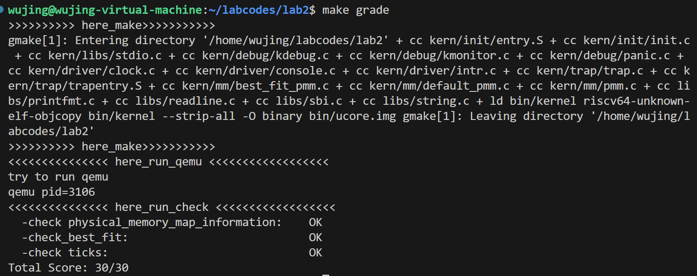

<h1><center>lab2实验报告</center></h1>

<center>组长：谢雯菲  学号：2110803</center>

<center>组员：吴静   学号：2113285</center>

<center>组员：李浩天  学号：2110133</center>

##一、练习一 
####准备部分
在正式介绍之前，先要来看看`memlayout.h`文件中的相关部分：

页面结构：

```
struct Page {
    int ref;                        //页面帧的引用计数
    uint64_t flags;                 //描述页面帧的状态，提供有关页面的额外信息
    unsigned int property;          //空闲页面块的数量
    list_entry_t page_link;         //用于构建双向链表的链表项
    list_entry_t pra_page_link;     // used for pra (page replace algorithm)
    uintptr_t pra_vaddr;            // used for pra (page replace algorithm)
};
```

一些宏定义：

```
/* Flags describing the status of a page frame */
#define PG_reserved                 0       //如果这个位（bit）的值等于1：表示该页面被内核保留，不能在分配/释放页面中使用
#define PG_property                 1       //如果这个位（bit）的值等于1：表示该页面是一个自由内存块的首页（包含一些连续地址的页面），可以在分配页面中使用

#define SetPageReserved(page)       set_bit(PG_reserved, &((page)->flags))
#define ClearPageReserved(page)     clear_bit(PG_reserved, &((page)->flags))
#define PageReserved(page)          test_bit(PG_reserved, &((page)->flags))
#define SetPageProperty(page)       set_bit(PG_property, &((page)->flags))
#define ClearPageProperty(page)     clear_bit(PG_property, &((page)->flags))
#define PageProperty(page)          test_bit(PG_property, &((page)->flags))
```

准备工作完成，接下来该逐个分析其中的函数： ####`default_init`
#### `default_init`
首先来看`default_init`，源码如下：

```
static void default_init(void) {
    list_init(&free_list);
    nr_free = 0;
}
```

该函数用于初始化 `free_list` 并将 `nr_free` 设置为 0，其中`free_list` 用于记录空闲内存块，`nr_free` 是空闲内存块的总数量。

####`default_init_memmap`
其次来看`default_init_memmap`。源码如下：

```
static void default_init_memmap(struct Page *base, size_t n) {
    assert(n > 0);
    struct Page *p = base;
    for (; p != base + n; p ++) {
        assert(PageReserved(p));
        p->flags = p->property = 0;
        set_page_ref(p, 0);
    }
    base->property = n;
    SetPageProperty(base);
    nr_free += n;
    if (list_empty(&free_list)) {
        list_add(&free_list, &(base->page_link));
    } else {
        list_entry_t* le = &free_list;
        while ((le = list_next(le)) != &free_list) {
            struct Page* page = le2page(le, page_link);
            if (base < page) {
                list_add_before(le, &(base->page_link));
                break;
            } else if (list_next(le) == &free_list) {
                list_add(le, &(base->page_link));
            }
        }
    }
}
```

该函数的目的是初始化一个包含 n 个页面的空闲块，这些页面在物理内存中是连续的。这个函数被用来创建一个空闲内存块，以便后续可以将这些页面用于内存分配。

函数的具体步骤如下：

1. 第一步 `assert(n>0);` 确保输入的页面数量有效。
2. 接下来，函数使用一个循环遍历从 `base` 到 `base + n` 的所有页面，对每个页面执行以下操作：
   - 首先，函数会断言页面是已保留的，即非空闲页面
   - 将页面的标志 `flags` 和属性 `property` 设置为 0，表示这些页面是空闲的，没有属性，使该成员变量只有在整个空闲块的第一个 Page 中才有意义
   - 函数调用 `set_page_ref` 来设置页面的引用计数为 0，因为这些页面现在是空闲的，没有被引用。
3. 接下来，对第一个页面的结构进行初始化，设置 `base` 页面的属性 `property` 为 `n`，表示这是一个包含 `n` 个页面的空闲块。
4. 函数调用 `SetPageProperty` 来设置 `base` 页面的 `PG_property` 标志位，表示这是一个有效的页面。
5. 函数增加 `nr_free`（空闲页面数量的全局变量）的值，以反映新的空闲页面的数量增加。
6. 最后，函数将这个新的空闲块添加到 `free_list` 中，以便后续的内存分配可以使用它。如果 `free_list` 为空，函数将直接将这个空闲块添加到 `free_list` 中。否则，函数会找到适当的插入位置，确保 `free_list` 中的页面是按地址顺序排列的。这是通过遍历 `free_list` 的方式来实现的，找到适当的插入位置，以确保页面按地址升序排序。

总之，`default_init_memmap` 函数用于初始化一个连续的空闲内存块，以便后续可以用于内存分配。它确保这些页面的属性正确设置，并将它们添加到空闲页面链表中，以便系统可以有效地管理和分配内存。

####`default_alloc_pages`
紧接着来分析`default_alloc_pages`，源码及注释如下：

```
static struct Page * default_alloc_pages(size_t n) {
    assert(n > 0);//确保 `n` 大于 0，即请求的页面数必须是正数。
    if (n > nr_free) {
        return NULL;
    }//检查请求的页面数是否超出了当前可用的空闲页面数量 `nr_free`,如果请求的页面数大于可用页面数，函数返回 `NULL`，表示无法满足请求
    struct Page *page = NULL;
    list_entry_t *le = &free_list;//声明一个指向空闲页面列表的链表项指针 `le`，并将其初始化为指向列表的头部
    while ((le = list_next(le)) != &free_list) {
        //遍历空闲页面列表
        struct Page *p = le2page(le, page_link);
        //通过 `le2page` 宏将链表项 `le` 转换为 `struct Page` 类型的指针`p`
        if (p->property >= n) {
            //查找满足条件的页面——空闲页面的数量大于请求页面的数量
            page = p;
            break;
        }
    }
    if (page != NULL) {
        list_entry_t* prev = list_prev(&(page->page_link));
        //`prev`为当前页面的前一个页面的链表项
        list_del(&(page->page_link));
        //从空闲页面列表中删除当前页面
        //如果当前页面更大，需要拆分出一个部分用于分配:
        if (page->property > n) {
            struct Page *p = page + n;
            //`p`指向当前页面加上 `n` 个页面后的位置，即剩余的页面
            p->property = page->property - n;
            //更新空闲页面数量
            SetPageProperty(p);
            //将剩余页面的第一个页面的`property`更新剩余空闲页面的数量
            list_add(prev, &(p->page_link));
            //将新空闲块插入空闲块列表中
        }
        nr_free -= n;
        //更新可用的空闲页面数量
        ClearPageProperty(page);
        //清除`PG_property`标志，表示该页面不再是空闲页面的排头
    }
    return page;
}
```

总结来说，这个函数的目标是实现分配页面的功能，它首先检查是否有足够的空闲页面，然后在空闲页面列表中查找足够大的页面以满足请求。如果找到，它将分配页面并更新空闲页面列表。如果没有足够的页面，则返回 `NULL`。

####`default_free_pages`
最后分析`default_free_pages`，源码及注释如下：

```
static void default_free_pages(struct Page *base, size_t n) {
    assert(n > 0);
    struct Page *p = base;
    for (; p != base + n; p ++) {
        assert(!PageReserved(p) && !PageProperty(p));
        //检查页面`p`既不是保留页面也不是属性页面，确保页面可以被释放,这是为了确保不会释放保留给内核使用的页面。
        p->flags = 0;
        //将页面的标志位清零，表示页面现在是空闲的
        set_page_ref(p, 0);
        //将页面的引用计数设置为0，表示没有页面引用它
    }
    base->property = n;
    //由于这是一个自由块的第一页，属性值有意义，同时块大小为`n`，所以设置`property`为`n`
    SetPageProperty(base);
    //表示他是空闲块的第一页
    nr_free += n;
    //更新空闲块的数量

    if (list_empty(&free_list)) {
        list_add(&free_list, &(base->page_link));
        //如果空闲页面列表`free_list`为空，将`base`作为空闲页面的开头
    } else {
        list_entry_t* le = &free_list;
        while ((le = list_next(le)) != &free_list) {
            struct Page* page = le2page(le, page_link);
            if (base < page) {
                list_add_before(le, &(base->page_link));
                break;
            } else if (list_next(le) == &free_list) {
                list_add(le, &(base->page_link));
            }
        }
        //如果列表不为空，将遍历空闲列表中的页面，找到适当的位置将`base`插入到其中，以确保页面按升序排列
    }

    list_entry_t* le = list_prev(&(base->page_link));
    //`le`是空闲页面列表中`base`前面一个页面的列表项
    if (le != &free_list) {
    //`le`不是头节点
        p = le2page(le, page_link);
        //将链表节点 `le` 转换为指向 `struct Page` 类型的指针，并将该指针存储在变量 `p` 中。
        if (p + p->property == base) {
            //`p + p->property`得出下一个空闲内存块的结束地址，如果这个结束地址等于 `base` 的起始地址，说明两个内存块是相邻的，要进行合并
            p->property += base->property;
            //合并后的内存块记录了更大的空闲块大小
            ClearPageProperty(base);
            //清除 `base` 的 `property` 标志，因为这个内存块已经不再是头部空闲块
            list_del(&(base->page_link));
            //从链表中删除 `base` 的节点
            base = p;
            //将 `base` 更新为 `p`
        }
    }
    //向前合并

    le = list_next(&(base->page_link));
    if (le != &free_list) {
        p = le2page(le, page_link);
        if (base + base->property == p) {
            base->property += p->property;
            ClearPageProperty(p);
            list_del(&(p->page_link));
        }
    }
    //向后合并
}
```

总的来说，这是一个用于释放一块内存的函数，主要用于管理空闲内存块的合并。

####改进空间

1. 可以改进的部分：

从时间角度来看，`First Fit` 内存分配算法的效率受到线性搜索的影响。当需要分配内存时，它需要遍历整个 `free_list` 链表来找到第一个足够大的内存块，而这个搜索过程的时间复杂度是 `O(n)`。

2. 可以从以下几个方面进行改进：

- **数据结构**。可以使用更高效的数据结构比如二叉搜索树，红黑树来代替链表，以提高搜索速度，可以将时间成本降低至对数级别。
- **缓存**。引入缓存机制，通过缓存最近分配的内存块或一些频繁使用的内存块，加速搜索过程。

##二、练习二

Lab2 添加代码如下：

```
static void
best_fit_init_memmap(struct Page *base, size_t n)
{
    …………
    for (; p != base + n; p++)
    {
        assert(PageReserved(p));

        /*LAB2 EXERCISE 2: YOUR CODE*/
        // 清空当前页框的标志和属性信息，并将页框的引用计数设置为0
        p->flags = p->property = 0;
        set_page_ref(p, 0);
        
    }
    …………
    else
    {
        list_entry_t *le = &free_list;
        while ((le = list_next(le)) != &free_list)
        {
            struct Page *page = le2page(le, page_link);
            /*LAB2 EXERCISE 2: YOUR CODE*/
            // 编写代码
            // 1、当base < page时，找到第一个大于base的页，将base插入到它前面，并退出循环
            // 2、当list_next(le) == &free_list时，若已经到达链表结尾，将base插入到链表尾部
            if (base < page)
            {
                list_add_before(le, &(base->page_link));
                break;
            }
            else if (list_next(le) == &free_list)
            {
                list_add(le, &(base->page_link));
            }
        }
    }
}
```
清空当前页框的标志和属性信息即直接设置这些成员变量为0，页框的引用计数的设置可以用`set_page_ref`进行设置。
后面的跟着进行写入即可，与`default_pmm`的实现原理一致。
```
static struct Page *
best_fit_alloc_pages(size_t n)
{
    assert(n > 0);
    if (n > nr_free)
    {
        return NULL;
    }
    struct Page *page = NULL;
    list_entry_t *le = &free_list;
    size_t min_size = nr_free + 1;
    /*LAB2 EXERCISE 2: YOUR CODE*/
    // 下面的代码是first-fit的部分代码，请修改下面的代码改为best-fit
    // 遍历空闲链表，查找满足需求的空闲页框
    // 如果找到满足需求的页面，记录该页面以及当前找到的最小连续空闲页框数量
    while ((le = list_next(le)) != &free_list)
    {
        struct Page *p = le2page(le, page_link);
        if (p->property >= n)
        {
            if (min_size > p->property)
            {
                page = p;
                min_size = p->property;
            }
            // page = p;
            // break;
        }
    }
    …………
}
```
这里可以注意到上方相对于`default_fit`多了一个`min_size`，这个`min_size`即用来记录找到的最小连续空闲页框数量，而我们要用`while`遍历空闲链表，查找满足要求的空闲页框`if (p->property >= n)`，记录该页面，注意此时是要找含最小连续空闲页框的页面，所以加了一个条件语句判断是否是包含最小连续页框的页面`if (min_size > p->property)`，最后进行页面`page`和`min_size`的赋值即可。
```
static void
best_fit_free_pages(struct Page *base, size_t n)
{
    …………
    /*LAB2 EXERCISE 2: YOUR CODE*/
    // 编写代码
    // 具体来说就是设置当前页块的属性为释放的页块数、并将当前页块标记为已分配状态、最后增加nr_free的值
    base->property = n;
    SetPageProperty(base);
    nr_free += n;
    …………
    list_entry_t *le = list_prev(&(base->page_link));
    if (le != &free_list)
    {
        p = le2page(le, page_link);
        /*LAB2 EXERCISE 2: YOUR CODE*/
        // 编写代码
        // 1、判断前面的空闲页块是否与当前页块是连续的，如果是连续的，则将当前页块合并到前面的空闲页块中
        // 2、首先更新前一个空闲页块的大小，加上当前页块的大小
        // 3、清除当前页块的属性标记，表示不再是空闲页块
        // 4、从链表中删除当前页块
        // 5、将指针指向前一个空闲页块，以便继续检查合并后的连续空闲页块
        if (p + p->property == base)
        {
            p->property += base->property;
            ClearPageProperty(base);
            list_del(&(base->page_link));
            base = p;
        }
    }
}
```
释放的页块数即`n`，设置当前页块的属性即设置`property`，将当前页块标记为已分配状态的函数为`SetPageProperty`，最后增加nr_free的值。
首先，判断是否连续，即判断前面空闲页面块的第一个页面加上`property`（即空闲页面数）的值是否为当前页面`if (p + p->property == base)`，如果是，则进入函数体，由于要进行合并，所以更新前一个空闲页面排头的空闲页面数`property`，需要加上当前页面的空闲页面数`p->property += base->property;`，由于当前页面不再是空闲页面的排头，所以需要清除属性标记，因为只有排头的属性标记是有意义的`ClearPageProperty(base);`，从链表中删除当前页块`list_del(&(base->page_link));`，将指针指向前一个空闲页块`base = p;`。

最后检查一下初始化的`pmm_manager`：
```
static void init_pmm_manager(void)
{
    pmm_manager = &best_fit_pmm_manager;
    cprintf("memory management: %s\n", pmm_manager->name);
    pmm_manager->init();
}
```
最后得到的结果为：

在改进空间上，我认为`best_fit`算法和`first_fit`算法一样，主要表现在时间效率上，每一次查找都要遍历，时间成本大大升高。
