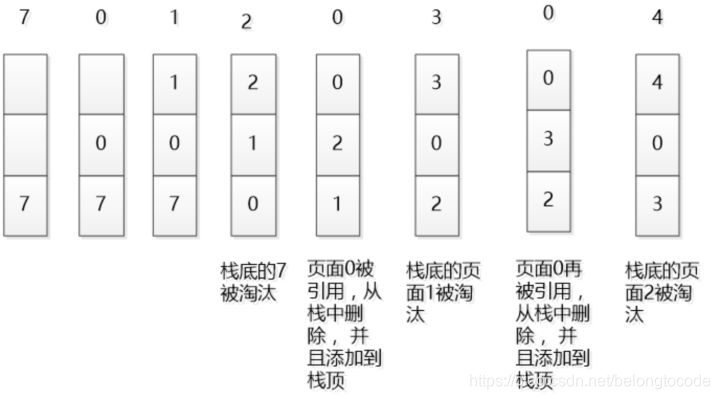
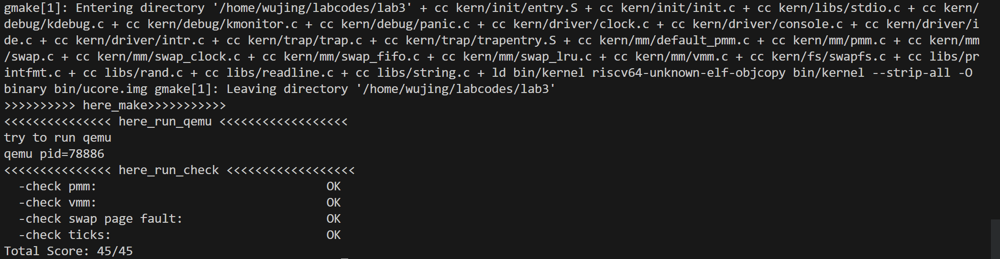

## 练习1：理解基于FIFO的页面替换算法

描述FIFO页面置换算法下，一个页面从被换入到被换出的过程中，会经过代码里哪些函数/宏的处理（或者说，需要调用哪些函数/宏），并用简单的一两句话描述每个函数在过程中做了什么？（FIFO页面置换算法头文件的大部分代码放在了`kern/mm/swap_fifo.c`文件中）

+ 至少正确指出10个不同的函数分别做了什么？少于10个将酌情给分。只要函数原型不同，就算两个不同的函数。要求指出对执行过程有实际影响，删去后会导致输出结果不同的函数（例如assert）而不是cprintf这样的函数。如果选择的函数不能完整地体现“从换入到换出”的过程，比如10个函数都是页面换入的时候调用的，或者解释功能的时候只解释了这10个函数在页面换入时的功能，那么也会扣除一定的分数。

#### 1. swap_in()函数

操作系统使用`swap_in()`函数将页面从磁盘的交换文件中交换到物理内存。

#### 2. alloc_page()函数

在页面换入时，需要申请一个页面读取换入的数据。`alloc_page()`函数调用`alloc_pages()`函数来分配得到一个页面。

#### 3. get_pte()函数

`get_pte()`函数找到或是构建根据所给的虚拟地址对应的页表项。这将用于后续对页表项的访问。

#### 4. swapfs_read()函数

其中，`swap_in()`函数调用了`swapfs_read()`函数从交换文件系统中读取数据到内存页面中。

#### 5. assert()函数

程序多处利用了`assert()`函数进行断言，确保条件成立。

#### 6. _fifo_map_swappable()函数

页面置换算法使用一个循环链表维护在内存中的页面。在将页面从磁盘中换入时，FIFO算法使用该函数直接将换入的页面加到管理页面链表的头部，也就是头指针的后一个节点。

#### 7. list_add()函数

`_fifo_map_swappable()`函数使用`list_add()`函数将表示某个页面的节点加到管理页面链表的指定位置。

#### 8. alloc_pages()函数

操作系统在分配连续的n个页面时，会调用`alloc_pages()`函数进行页面的分配。其中，如果试图得到空闲页且没有空闲的物理页时，操作系统尝试换出页面到硬盘上。

#### 9. swap_out()函数

操作系统使用`swap_out()`函数将页面从物理内存交换到磁盘的交换文件中。

#### 10. _fifo_swap_out_victim()函数

在处理换出页面时，FIFO算法在该函数中直接将管理链表的尾节点页面（即head指针的前一个节点）换出，也就时最先进入内存的页面。该函数找到该换出的页面并且返回其页面结构的地址。

#### 11. list_prev()函数

`_fifo_swap_out_victim()`函数使用`list_prev()`函数获取链表的头节点。

#### 12. list_del()函数

`list_del()`函数用于删除链表中某个节点。

#### 13. swapfs_write()函数

`swap_out()`函数调用`swapfs_write()`函数将要换出的物理页面写到硬盘上的交换区。

#### 14. free_pages()函数

该函数释放连续的n页。在成功换出页面后，将会使用`free_page()`函数调用该函数释放换出的页。

#### 15. tlb_invalidate()函数

该函数用于刷新TLB，在成功换出页面后会调用该函数刷新TLB。


## 练习2：深入理解不同分页模式的工作原理（思考题）

`get_pte()`函数（位于`kern/mm/pmm.c`）用于在页表中查找或创建页表项，从而实现对指定线性地址对应的物理页的访问和映射操作。这在操作系统中的分页机制下，是实现虚拟内存与物理内存之间映射关系非常重要的内容。

- `get_pte()`函数中有两段形式类似的代码， 结合`sv32`，`sv39`，`sv48`的异同，解释这两段代码为什么如此相像。
- 目前`get_pte()`函数将页表项的查找和页表项的分配合并在一个函数里，你认为这种写法好吗？有没有必要把两个功能拆开？

### 答：

### 1. get_pte()函数中有两段形式类似的代码， 结合sv32，sv39，sv48的异同，解释这两段代码为什么如此相像。

`sv32`，`sv39`，`sv48`是RISC-V架构中的三种不同的页表模式，数字32/39/48表示存储系统中使用32/39/48位的虚拟地址。在sv32模式下，页表采用两级结构；在`sv39`模式下，页表采用三级结构；在sv48模式下，页表采用四级结构。

本实验采用`sv39`，`sv39`中采用的是三级页表，页表项（Page Table Entry，PTE）里从高到低三级页表的页码分别为`PDX1`, `PDX0`和`PTX`(Page Table Index)。

接下来看`get_pte()`函数的代码部分。

```c
pte_t *get_pte(pde_t *pgdir, uintptr_t la, bool create) 
```

`pgdir`为页表基址，`la`为虚拟地址，`get_pte()`函数通过虚拟地址`la`寻找对应的页表项，如果不存在则分配页表项。

```c
   {
     pde_t *pdep1 = &pgdir[PDX1(la)];
    if (!(*pdep1 & PTE_V)) {
        struct Page *page;
        if (!create || (page = alloc_page()) == NULL) {
            return NULL;
        }
        set_page_ref(page, 1);
        uintptr_t pa = page2pa(page);
        memset(KADDR(pa), 0, PGSIZE);
        *pdep1 = pte_create(page2ppn(page), PTE_U | PTE_V);
    }
```

这一段代码找到了最高级页表项的地址`pdep1`；然后，通过检验有效位`PTE_V`判断是否存在对应页表。如果存在则进入下一部分代码。

如果不存在则分配页并创建新页表：

```c
    pde_t *pdep0 = &((pde_t *)KADDR(PDE_ADDR(*pdep1)))[PDX0(la)];
//    pde_t *pdep0 = &((pde_t *)(PDE_ADDR(*pdep1)))[PDX0(la)];
    if (!(*pdep0 & PTE_V)) {
        struct Page *page;
        if (!create || (page = alloc_page()) == NULL) {
            return NULL;
        }
        set_page_ref(page, 1);
        uintptr_t pa = page2pa(page);
        memset(KADDR(pa), 0, PGSIZE);
 //       memset(pa, 0, PGSIZE);
        *pdep0 = pte_create(page2ppn(page), PTE_U | PTE_V);
    }
```

这一段代码与上一段逻辑一致。

```c
   return &((pte_t *)KADDR(PDE_ADDR(*pdep0)))[PTX(la)];
}
```

返回页表项地址。

这两段代码相似的原因是，多级页表不同级之间的基本结构和操作逻辑是相似的，RISC-V不同页表模式之间也是类似的，不同的只是地址空间大小和页表的层次结构。因此，为了处理不同的地址空间大小，可以重用类似的代码结构，仅仅根据具体的需求调整页表项的大小和页表的层次结构。

### 2. 目前get_pte()函数将页表项的查找和页表项的分配合并在一个函数里，你认为这种写法好吗？有没有必要把两个功能拆开？

### 答：

好。

目前阶段实现的操作系统内容较少，功能相对单薄。使用`get_pte()`函数进行页表项的查找和分配时涉及的代码量较少且结构清晰，逻辑流程简单。将上述功能合并在一个函数内不会造成代码的易读性下降，相反还能减少函数的调用，简化代码，更加适合学习。

此外较少的函数调用可以减少系统开销，优化性能。


## 练习3：给未被映射的地址映射上物理页

补充完成`do_pgfault (mm/vmm.c)`函数，给未被映射的地址映射上物理页。设置访问权限的时候需要参考页面所在`VMA`的权限，同时需要注意映射物理页时需要操作内存控制结构所指定的页面，而不是内核的页表。请在实验报告中简要说明你的设计实现过程。请回答如下问题：

+ 请描述页目录项（Page Directory Entry）和页表项（Page Table Entry）中组成部分对ucore实现页替换算法的潜在用处。
+ 如果ucore的缺页服务例程在执行过程中访问内存，出现了页访问异常，请问硬件要做哪些事情？
+ 数据结构Page的全局变量（其实是一个数组）的每一项与页表中的页目录项和页表项有无对应关系？如果有，其对应关系是啥？

#### 编程

补充的代码是在ptep不为空的前提下，也就是对应的页表项已经存在的情况下。此时，只需要将磁盘加载数据并放到带有物理地址的页面，然后将物理地址与虚拟地址进行映射，触发交换管理器记录该页面的访问情况即可。

+ 使用`swap_in()`函数分配一个内存页，然后将磁盘的内容读入这个内存页。
+ 使用`page_insert()`函数将该虚拟地址加入页目录的映射。
+ 使用`swap_map_swappable()`函数设置页面为可交换。

补充完整的代码如下所示：

```C++
if (swap_init_ok) {
    struct Page *page = NULL;
    // 得到虚拟地址对应的物理地址
    // 从磁盘加载数据并放到addr的页面
    ret=swap_in(mm,addr,&page);
    if(ret!=0){
        cprintf("swap failed\n");
        goto failed;
    }
    //加入映射
    page_insert(mm->pgdir,page,addr,perm);
    // 设置页面可交换
    swap_map_swappable(mm,addr,page,1);
    page->pra_vaddr = addr;
} else {
    cprintf("no swap_init_ok but ptep is %x, failed\n", *ptep);
    goto failed;
}
```

#### 问题回答

**请描述页目录项（Page Directory Entry）和页表项（Page Table Entry）中组成部分对ucore实现页替换算法的潜在用处。**

在`do_pgfault (mm/vmm.c)`函数中，实现下述功能的函数需要用到`mm`的页目录项：

1. 根据提供的虚拟地址找到相应的页表项：

```C++
ptep = get_pte(mm->pgdir, addr, 1)
```

2. 根据提供的虚拟地址和权限，创建新的页面映射物理地址时：

```C++
pgdir_alloc_page(mm->pgdir, addr, perm)
```

3. 根据提供的页、虚拟地址和权限，向对应页目录项插入页建立映射时：

```C++
page_insert(mm->pgdir,page,addr,perm)
```

由上述分析可知，页目录项在进行索引时有重要的作用。

就页表项而言，在`do_pgfault (mm/vmm.c)`函数中，获取了表示页表项的指针`ptep`，通过判断页表项是否为空，来决定是否要创建一个新的页表项来映射该地址。

**如果ucore的缺页服务例程在执行过程中访问内存，出现了页访问异常，请问硬件要做哪些事情？**

1. 保存当前CPU寄存器的状态（在`stval`寄存器中存储了出错的虚拟地址）。
2. 转入异常处理程序`pgfault_handler()`。
3. 传递访问出错的虚拟地址，继而执行处理页面故障的函数`do_pgfault()`，根据访问的地址，尝试通过页面置换、页面加载解决缺页。
4. 恢复CPU状态、恢复正常执行。

**数据结构Page的全局变量（其实是一个数组）的每一项与页表中的页目录项和页表项有无对应关系？如果有，其对应关系是啥？**

有关系。

Page的flags主要有两个参数：`PG_reserved`和`PG_Property`。其中，`PG_reserved`表示这个页已经被分配了，不能被alloc或者free；`PG_property`表示这个页是否是空闲的block的开始。

这两个参数和页表项的一些参数有关系。比如`PG_reserved`为1时，表示该页被保留，那么在页表项的`PTE_U`属性会为0，也就是说该页不能在用户态下被分配或释放。


## 练习4：补充完成Clock页替换算法（需要编程）

通过之前的练习，相信大家对FIFO的页面替换算法有了更深入的了解，现在请在我们给出的框架上，填写代码，实现 Clock页替换算法（mm/swap_clock.c）。(提示:要输出curr_ptr的值才能通过make grade)

请在实验报告中简要说明你的设计实现过程。请回答如下问题：

- 比较Clock页替换算法和FIFO算法的不同。

### 答：

### 设计实现过程：

1. 算法的初始化函数

```c
static int
_clock_init_mm(struct mm_struct *mm)
{     
     /*LAB3 EXERCISE 4: 2110133*/ 
     // 初始化pra_list_head为空链表
     // 初始化当前指针curr_ptr指向pra_list_head，表示当前页面替换位置为链表头
     // 将mm的私有成员指针指向pra_list_head，用于后续的页面替换算法操作
     //cprintf(" mm->sm_priv %x in fifo_init_mm\n",mm->sm_priv);

     list_init(&pra_list_head);
     curr_ptr = &pra_list_head; 
     mm->sm_priv = &pra_list_head;
     cprintf(" mm->sm_priv %x in fifo_init_mm\n",mm->sm_priv);
     return 0;
}
```

算法需要的数据结构链表定义于`lab3/libs/list.h`。

初始化环形链表`pra_list_head`，初始化`curr_ptr`，将`mm->sm_priv`指向该环形链表头部，后续流程需要该指针访问环形链表。

2. 算法的链入新页面函数

```c
static int
_clock_map_swappable(struct mm_struct *mm, uintptr_t addr, struct Page *page, int swap_in)
{
    list_entry_t *entry=&(page->pra_page_link);

    assert(entry != NULL && curr_ptr != NULL);
    //record the page access situlation
    /*LAB3 EXERCISE 4: 2110133*/ 
    // link the most recent arrival page at the back of the pra_list_head qeueue.
    // 将页面page插入到页面链表pra_list_head的末尾
    // 将页面的visited标志置为1，表示该页面已被访问

    list_add(mm->sm_priv,entry);
    page->visited = 1;
    return 0;
}
```

定义指针`entry`指向需要链入的新页面`page`，调用函数`list_add()`，将该页面链入环形链表`pra_list_head`，并设置该页面的标志`visited`为1。

3. 算法的寻找换出页面函数

```c
static int
_clock_swap_out_victim(struct mm_struct *mm, struct Page ** ptr_page, int in_tick)
{

     list_entry_t *head=(list_entry_t*) mm->sm_priv;
         assert(head != NULL);
     assert(in_tick==0);
     /* Select the victim */
     //(1)  unlink the  earliest arrival page in front of pra_list_head qeueue
     //(2)  set the addr of addr of this page to ptr_page
     curr_ptr = list_prev(head);
    while (1) {
        /*LAB3 EXERCISE 4: 2110133*/ 
        // 编写代码
        // 遍历页面链表pra_list_head，查找最早未被访问的页面
        // 获取当前页面对应的Page结构指针
        // 如果当前页面未被访问，则将该页面从页面链表中删除，并将该页面指针赋值给ptr_page作为换出页面
        // 如果当前页面已被访问，则将visited标志置为0，表示该页面已被重新访问

        //使用curr_ptr遍历页面链表，curr_ptr开始时指向head之前的节点
        struct Page * curr_page = le2page(curr_ptr, pra_page_link);
        //使用curr_page访问visited标志
        if(curr_page->visited == 0)//此页面为最早未被访问的页面
        { 
            //cprintf("1");
            list_del(curr_ptr);//删除
            *ptr_page=curr_page;//赋值，作为换出
            cprintf("curr_ptr %p\n",curr_ptr);//输出curr_ptr的值
            return 0;
        }
        else//该页面已被访问，设置visited标志，curr_ptr前移
        {
            //cprintf("2");
            curr_page->visited=0;
            curr_ptr=list_prev(curr_ptr);
        }
    }
    return 0;
}
```

使用指针`curr_ptr`遍历环形链表，寻找最早未被访问的页面，`curr_ptr`在循环开始时指向环形链表最早链入的结点；

循环开始后，定义页面结构体指针`curr_page`来访问当前页面的visited标志；

若标志`visited`为0，即当前页面未被访问，则将该页面从页面链表中删除，并将该页面指针赋值给`ptr_page`作为换出页面；

若标志`visited`为1，即当前页面已被访问，则将标志`visited`置为0，表示该页面已被重新访问。

### 回答问题：比较Clock页替换算法和FIFO算法的不同

1. **FIFO页替换算法：** 该算法总是淘汰最先进入内存的页，即选择在内存中驻留时间最久的页予以淘汰。代码实现可以采用队列的数据结构（或本实验中的链表）。FIFO算法在应用程序按照线性顺序访问地址空间时效率较高，但实际情况下由于访问频率较高的页面往往在内存中驻留时间较长，导致FIFO算法效率较为低下。此外FIFO算法具有异常现象：Belady 现象，在增加放置页的物理页帧的情况下，反而使页访问异常次数增多。

2. **Clock页替换算法：** Clock页替换算法把各个页组织成环形链表的形式，每个页具有一个访问位，当页面被访问时，访问位被设置为1，当需要替换页面时，从当前位置开始查找访问位为0的页面进行替换。代码实现需要使用环形链表的数据结构，且需要更新页面的访问位，实现起来略微复杂。Clock页替换算法不存在Belady现象，维护开销较少，访问性能更为优秀。


## 练习5：如果我们采用“一个大页”的页表映射方式，相比分级页表，有什么好处、优势，有什么坏处、风险?

**优势：**

完成一次地址转换不需要多次访问页表。

**劣势：**

1.内存空间的浪费，页表空间的分配更不灵活。

单级页表在进程创建时为可能用到的所有的页表项分配空间；而多级页表可以在使用时根据内存的占用为进程分配页表空间，可以实现按需分配而不是预先全部分配。

2.采用连续分配的方式，内存利用率低。

多级页表的页表空间采用离散分配的方式，相较于“一个大页”的分配方式的内存利用率更高。


## challenge——LRU

### 代码实现

`LRU`的全称是`least recently used`，即最久未使用算法。

基本思路如下：

`LRU`算法每次剔除的是最久未使用的页面，所以在每次插入页面时首先进行一次查询，查看是否原链表中有相同的页面，如果有则删除该页面，并将该页面插入至首元素，表示最近被访问的页面（把该页面替换为链表头页面）；如果没有则直接插入到头节点处；

每次删除页面时删除链表尾页面即可（即最久未被使用的页面）

流程图如下图所示：



本次实验主要改动了三个函数：初始化函数`_lru_init_mm`，换入页面函数`_lru_map_swappable`以及删除页面函数`_lru_swap_out_victim`。

首先是初始化函数`_lru_init_mm`：

代码如下：
```c
// 初始化一个名为 pra_list_head 的双向链表
static int
_lru_init_mm(struct mm_struct *mm)
{
    // 初始化pra_list_head为空链表
    list_init(&pra_list_head);

    // 初始化当前指针curr_ptr指向pra_list_head，表示当前页面替换位置为链表头
    curr_ptr = &pra_list_head;

    // 将mm的私有成员指针指向pra_list_head，用于后续的页面替换算法操作
    mm->sm_priv = &pra_list_head;

    cprintf(" mm->sm_priv %x in lru_init_mm\n", mm->sm_priv);
    cprintf("\n");
    return 0;
}
```

和前面的`FIFO`算法和`CLOCK`算法类似，都是先初始化了一个空链表`pra_list_head`，初始化`sm_pirv`成员变量，这个成员变量可以将页面帧链表与内存管理子系统中的页面替换算法联系起来；初始化指针`curr_ptr`，这个指针指向当前操纵的页面，比如删除页面时就指向删除页面的位置，插入页面时就指向插入页面的位置，此时指向的初始化页面的位置，即链表头。

接下来是换入页面函数`_lru_map_swappable`：

代码如下：
```c
// 插入页面
static int
_lru_map_swappable(struct mm_struct *mm, uintptr_t addr, struct Page *page, int swap_in)
{
    // 内存管理结构体，用于确定要执行页面插入操作的特定进程或任务
    // addr要插入页面的虚拟地址
    // page要插入的页面对象的指针
    // swap_in是否执行页面交换（swap in）操作
    // 输出参数 ptr_page 来返回所选择的页面帧
    list_entry_t *head = (list_entry_t *)mm->sm_priv;
    list_entry_t *entry = &(page->pra_page_link); // page链入link的指针

    assert(entry != NULL && head != NULL);

    if (is_page_in_list(head, page))
    {
        list_del(get_list_page(head, page));
        struct Page *curr_page = le2page(curr_ptr, pra_page_link);
        cprintf("\n");
        cprintf("out:curr_pra_vaddr %p\n", curr_page->pra_vaddr);
    }

    // 添加当前页面至链表头，表示最近访问
    list_add(head, entry);

    curr_ptr = entry;
    cprintf("\n");
    cprintf("in:curr_ptr %p\n", curr_ptr);

    return 0;
}
```

这里使用了另外两个函数`is_page_in_list`，判断该页面是否在原链表中出现过；以及`get_list_page`函数，获取出现过的页面的索引。

具体实现如下：
`is_page_in_list`：
```c
bool is_page_in_list(list_entry_t *head, struct Page *target_page)
{
    list_entry_t *entry;

    // 遍历链表
    for (entry = (head)->next; entry != (entry); entry = entry->next)
    {
        // 获取当前节点的 Page 指针
        struct Page *page = le2page(entry, pra_page_link);

        // 检查当前节点的 Page 是否与目标页面相同
        if (page == target_page)
        {
            return true; // 找到了目标页面
        }
    }

    return false; // 遍历完链表都没有找到目标页面
}
```

`get_list_page`:
```c
list_entry_t *get_list_page(list_entry_t *head, struct Page *target_page)
{
    list_entry_t *entry;
    // 遍历链表
    for (entry = (head)->next; entry != (entry); entry = entry->next)
    {
        // 获取当前节点的 Page 指针
        struct Page *page = le2page(entry, pra_page_link);

        // 检查当前节点的 Page 是否与目标页面相同
        if (page == target_page)
        {
            return entry; // 找到了目标页面
        }
    }

    return NULL; // 遍历完链表都没有找到目标页面
}
```

上述两个函数的实现比较简单，大概思路就是遍历链表，获取遍历到的每个节点的对应的页面（使用`le2page`函数），然后和目标页面进行比较，如果比对成功，则说明原链表中含有该页面，可以进行判断或者取出索引值。

再来说回插入页面的函数，这里的`entry`为`page`页面中代表链入链表`list`的指针，首先判断链表中是否含有该页面，如果有进行删除，然后进行页面的插入；如果没有则直接进行页面的插入。用`list_add`函数添加当前页面至链表，这里插入的是`head`的后面，即链表的第一个元素。

最后是删除页面函数`_lru_swap_out_victim`：

代码如下：
```c
// 删除页面——删除链表尾的页面
static int
_lru_swap_out_victim(struct mm_struct *mm, struct Page **ptr_page, int in_tick)
{
    list_entry_t *head = (list_entry_t *)mm->sm_priv;
    assert(head != NULL);
    assert(in_tick == 0);

    list_entry_t *le = head->prev;

    curr_ptr = le;

    struct Page *curr_page = le2page(curr_ptr, pra_page_link);

    list_del(le);

    cprintf("out:curr_ptr %p\n\n", curr_ptr);
    assert(curr_ptr != NULL);

    *ptr_page = curr_page;
    return 0;
}
```

该函数的实现也比较简单，注意以下几点即可：

- `list_entry_t *le = head->prev;`句是将`le`赋值为链表的最后一个元素，因为这个链表是双向链表，在初始化的时候前指针和后指针都指向自己，而在插入的时候前页面的后指针指向自己，自己的前指针指向前页面，自己的后指针指向前页面的后指针，即前页面自身（可能有点绕，代码见下），所以此时`head`节点的前面一个节点对应的是最后一个页面。

- 将最后一个节点用`list_del`函数进行删除即可。

- 使用 `*ptr_page = curr_page;`可以方便调用者在函数返回后访问 `curr_page`。

链表初始化相关代码：
```c
static inline void
list_init(list_entry_t *elm) {
    elm->prev = elm->next = elm;
}

static inline void
list_add(list_entry_t *listelm, list_entry_t *elm) {
    list_add_after(listelm, elm);
}

static inline void
list_add_after(list_entry_t *listelm, list_entry_t *elm) {
    __list_add(elm, listelm, listelm->next);
}

static inline void
__list_add(list_entry_t *elm, list_entry_t *prev, list_entry_t *next) {
    prev->next = next->prev = elm;
    elm->next = next;
    elm->prev = prev;
}
```

### 运行结果及解释：

`make qemu`运行后结果：
```
OpenSBI v0.4 (Jul  2 2019 11:53:53)
   ____                    _____ ____ _____
  / __ \                  / ____|  _ \_   _|
 | |  | |_ __   ___ _ __ | (___ | |_) || |
 | |  | | '_ \ / _ \ '_ \ \___ \|  _ < | |
 | |__| | |_) |  __/ | | |____) | |_) || |_
  \____/| .__/ \___|_| |_|_____/|____/_____|
        | |
        |_|

Platform Name          : QEMU Virt Machine
Platform HART Features : RV64ACDFIMSU
Platform Max HARTs     : 8
Current Hart           : 0
Firmware Base          : 0x80000000
Firmware Size          : 112 KB
Runtime SBI Version    : 0.1

PMP0: 0x0000000080000000-0x000000008001ffff (A)
PMP1: 0x0000000000000000-0xffffffffffffffff (A,R,W,X)
(THU.CST) os is loading ...

Special kernel symbols:
  entry  0xc0200036 (virtual)
  etext  0xc0204328 (virtual)
  edata  0xc020a040 (virtual)
  end    0xc0211598 (virtual)
Kernel executable memory footprint: 70KB
memory management: default_pmm_manager
membegin 80200000 memend 88000000 mem_size 7e00000
physcial memory map:
  memory: 0x07e00000, [0x80200000, 0x87ffffff].
check_alloc_page() succeeded!
check_pgdir() succeeded!
check_boot_pgdir() succeeded!
check_vma_struct() succeeded!
Store/AMO page fault
page fault at 0x00000100: K/W
check_pgfault() succeeded!
check_vmm() succeeded.
SWAP: manager = lru swap manager
BEGIN check_swap: count 2, total 31661
 mm->sm_priv c0211578 in lru_init_mm

setup Page Table for vaddr 0X1000, so alloc a page
setup Page Table vaddr 0~4MB OVER!
set up init env for check_swap begin!
Store/AMO page fault
page fault at 0x00001000: K/W

in:curr_ptr 0xffffffffc02258a8
Store/AMO page fault
page fault at 0x00002000: K/W

in:curr_ptr 0xffffffffc02258f0
Store/AMO page fault
page fault at 0x00003000: K/W

in:curr_ptr 0xffffffffc0225938
Store/AMO page fault
page fault at 0x00004000: K/W

in:curr_ptr 0xffffffffc0225980
set up init env for check_swap over!
Store/AMO page fault
page fault at 0x00005000: K/W
out:curr_ptr 0xffffffffc02258a8

swap_out: i 0, store page in vaddr 0x1000 to disk swap entry 2

in:curr_ptr 0xffffffffc02258a8
Load page fault
page fault at 0x00001000: K/R
out:curr_ptr 0xffffffffc02258f0

swap_out: i 0, store page in vaddr 0x2000 to disk swap entry 3
swap_in: load disk swap entry 2 with swap_page in vadr 0x1000

in:curr_ptr 0xffffffffc02258f0
count is 1, total is 8
check_swap() succeeded!
++ setup timer interrupts
100 ticks
100 ticks
100 ticks
```

可以看到，在每一次访问页面抛出异常时，都会进行页面的置换操作，通过该命令的输出，我们可以验证得出，该页面的置换操作符合`LRU`算法思想。

`make grade`运行后结果：
