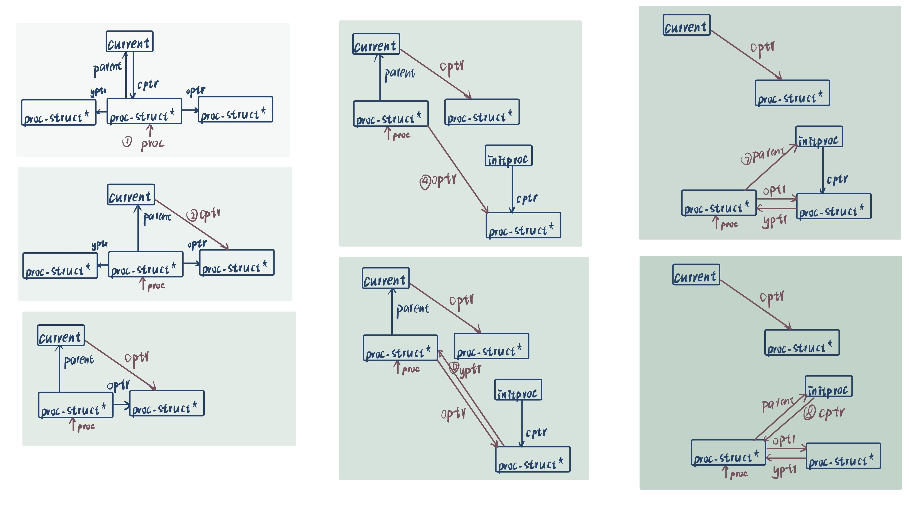
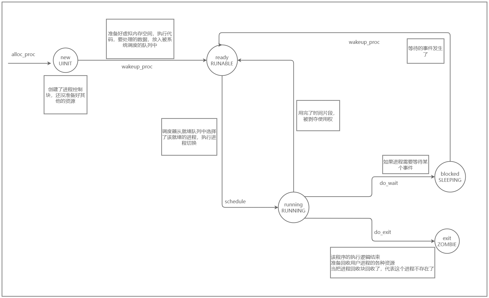
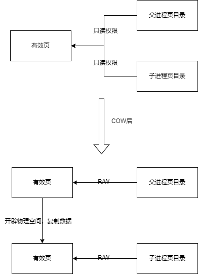
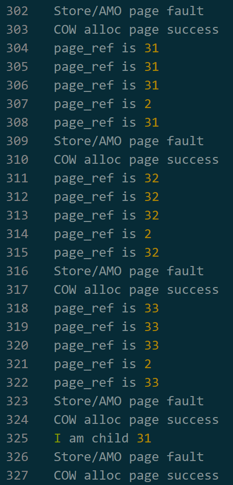

## 练习0：填写已有实验

`本实验依赖实验1/2/3/4。请把你做的实验1/2/3/4的代码填入本实验中代码中有“LAB1”/“LAB2”/“LAB3”/“LAB4”的注释相应部分。注意：为了能够正确执行lab5的测试应用程序，可能需对已完成的实验1/2/3/4的代码进行进一步改进。`

为了实现lab5的功能，需要对以下提到的函数内容进行更新。

### `alloc_proc()`函数

`proc_struct`相较于lab4增添了`wait_state`进程等待状态、`cptr`、`optr`和`yptr`（这三个表示进程间的关系）四个变量。
需要将`wait_state`初始化为0，将后三个指针初始化为NULL，避免之后由于未定义或未初始化导致管理用户进程时出现错误。

更新后的`alloc_proc()`函数如下所示：

```C
static struct proc_struct *
alloc_proc(void) {
    struct proc_struct *proc = kmalloc(sizeof(struct proc_struct));
    if (proc != NULL) {
    //LAB4:EXERCISE1 YOUR CODE 2110803
        proc->state = PROC_UNINIT;//设置进程为未初始化状态
        proc->pid = -1;          //未初始化的进程id=-1
        proc->runs = 0;          //初始化时间片
        proc->kstack = 0;      //初始化内存栈的地址
        proc->need_resched = 0;   //是否需要调度设为不需要
        proc->parent = NULL;      //置空父节点
        proc->mm = NULL;      //置空虚拟内存
        memset(&(proc->context), 0, sizeof(struct context));//初始化上下文
        proc->tf = NULL;      //中断帧指针设置为空
        proc->cr3 = boot_cr3;      //页目录设为内核页目录表的基址
        proc->flags = 0;      //初始化标志位
        memset(proc->name, 0, PROC_NAME_LEN);//置空进程名

     //LAB5 YOUR CODE : (update LAB4 steps) 2110803
        proc->wait_state = 0;  //初始化进程等待状态  
        proc->cptr = proc->optr = proc->yptr = NULL;//进程相关指针初始化
    }
    return proc;
}
```

### `do_fork()`函数

为了实现用户进程的管理，需要将`do_fork()`函数中子进程的父进程设置为current process，并且确保当前进程的等待状态为0。此外，需要将新进程加入`hash_list`，并且使用`set_links()`函数设置相关进程的链接。

更新后的`do_fork()`函数如下所示：

```C
int
do_fork(uint32_t clone_flags, uintptr_t stack, struct trapframe *tf) {
    int ret = -E_NO_FREE_PROC;
    struct proc_struct *proc;
    if (nr_process >= MAX_PROCESS) {
        goto fork_out;
    }
    ret = -E_NO_MEM;

    //LAB4:EXERCISE2 YOUR CODE
    if((proc=alloc_proc())==NULL){
        //如果没有分配成功
        goto fork_out;
    }
    //将子进程的父节点设置为当前进程
    proc->parent=current;
    //lab5
    //确保当前进程正在等待
    assert(current->wait_state == 0);

    //    2. call setup_kstack to allocate a kernel stack for child process
    //分配并初始化内核栈
    if(setup_kstack(proc)!=0){
        //如果没有分配成功
        goto bad_fork_cleanup_kstack;
    }

    //    3. call copy_mm to dup OR share mm according clone_flag
    //根据clone_flags决定是复制还是共享内存管理系统（copy_mm函数）,本次实验暂未涉及
    if(copy_mm(clone_flags,proc)!=0){
        goto bad_fork_cleanup_proc;
    }

    //    4. call copy_thread to setup tf & context in proc_struct
    //设置进程的中断帧和上下文(copy_thread函数)(复制父进程的中断帧和上下文信息)
    copy_thread(proc,stack,tf);

    //    5. insert proc_struct into hash_list && proc_list
    //把设置好的进程加入链表
    bool intr_flag;
    local_intr_save(intr_flag);
    {
        proc->pid = get_pid();
        hash_proc(proc);   //将新进程加入hash_list
        // 删除原来的 nr_process++ 和 加入链表 
        set_links(proc);   //执行set_links函数，实现设置相关进程链接
    }
    local_intr_restore(intr_flag);

    //    6. call wakeup_proc to make the new child process RUNNABLE
    //将新建的进程设为就绪态
    wakeup_proc(proc);

    //    7. set ret vaule using child proc's pid
    //将返回值设为线程id
    ret=proc->pid;
 
fork_out:
    return ret;

bad_fork_cleanup_kstack:
    put_kstack(proc);
bad_fork_cleanup_proc:
    kfree(proc);
    goto fork_out;
}
```

## 练习1: 加载应用程序并执行（需要编码）

**do_execv**函数调用`load_icode`（位于kern/process/proc.c中）来加载并解析一个处于内存中的ELF执行文件格式的应用程序。你需要补充`load_icode`的第6步，建立相应的用户内存空间来放置应用程序的代码段、数据段等，且要设置好`proc_struct`结构中的成员变量trapframe中的内容，确保在执行此进程后，能够从应用程序设定的起始执行地址开始执行。需设置正确的trapframe内容。

请在实验报告中简要说明你的设计实现过程。

- 请简要描述这个用户态进程被ucore选择占用CPU执行（RUNNING态）到具体执行应用程序第一条指令的整个经过。

### 答：

#### 1. 补充代码如下：

```c
    //(6) setup trapframe for user environment
    struct trapframe *tf = current->tf;
    // Keep sstatus
    uintptr_t sstatus = tf->status;
    memset(tf, 0, sizeof(struct trapframe));
    /* LAB5:EXERCISE1 2110133  
     * should set tf->gpr.sp, tf->epc, tf->status
     * NOTICE: If we set trapframe correctly, then the user level process can return to USER MODE from kernel. So
     *          tf->gpr.sp should be user stack top (the value of sp)
     *          tf->epc should be entry point of user program (the value of sepc)
     *          tf->status should be appropriate for user program (the value of sstatus)
     *          hint: check meaning of SPP, SPIE in SSTATUS, use them by SSTATUS_SPP, SSTATUS_SPIE(defined in risv.h)
     */

    tf->gpr.sp = USTACKTOP; 
    tf->epc = elf->e_entry;
    tf->status = (sstatus & ~SSTATUS_SPP) | SSTATUS_SPIE;

    ret = 0;
```

#### 2. 设计实现过程：

实验要求续写函数`load_icode`的第六步：为用户态进程设置中断帧。操作系统在执行完成函数`load_icode`之后将执行中断并返回，然后开始执行该用户态进程的程序。由此可知，函数load_icode需要在第六步完成：

1. 将中断帧存储的栈顶指针寄存器`tf->gpr.sp`设置为用户栈栈顶地址`USTACKTOP`，确保中断返回后程序可以正确访问用户栈。

2. 将中断帧存储的异常程序寄存器tf->epc设置为该用户态进程程序的入口点，确保中断返回后程序可以正确地开始执行。

3. 设置中断帧存储的状态寄存器tf->status: 
   
   SPP: 用于保存中断发生之前的特权级。SPP为0表示中断发生之前，处理器处于用户级（User/Application）；SPP为1表示中断发生之前，处理器处于特权级（Supervisor）。
   
   当中断返回后，特权级将根据SPP的值返回到中断之前的状态。由于程序需要在中断返回后执行用户态进程程序，特权级为用户级，SPP的值应为0。
   
   SPIE: 用于保存中断发生之前的中断使能状态。SPIE为0表示处理器中断发生之前，特权级的中断使能位为0，即特权级中断被禁用；SPIE为1表示处理器中断发生之前，特权级的中断使能位为1，即特权级中断被启用；由于程序在执行用户态进程程序时，中断应可以正常触发，SPIE应为1.

#### 3. 该用户态进程被ucore选择占用CPU执行（RUNNING态）到具体执行应用程序第一条指令的整个经过：

1. 操作系统调度过程（练习3重点叙述）

2. 加载应用程序的二进制代码，建立程序运行的环境（函数load_icode）
   
   ```c
   static int
   load_icode(unsigned char *binary, size_t size) {
    //当前内存空间必须为空
    if (current->mm != NULL) {
        panic("load_icode: current->mm must be empty.\n");
    }
   
    int ret = -E_NO_MEM;
    struct mm_struct *mm;
    //(1) create a new mm for current process
    //（1）为进程创建新的内存管理空间
    if ((mm = mm_create()) == NULL) {
        goto bad_mm;
    }
    //(2) create a new PDT, and mm->pgdir= kernel virtual addr of PDT
    //（2）创建新的页目录表：
    //申请一个页目录表所需的一个页大小的内存空间
    //把描述ucore内核虚空间映射的内核页表的内容拷贝到新目录表中
    //让mm->pgdir指向此页目录表
    //完成新进程页目录表的创建，且能够正确映射内核虚空间
    if (setup_pgdir(mm) != 0) {
        goto bad_pgdir_cleanup_mm;
    }
    //(3) copy TEXT/DATA section, build BSS parts in binary to memory space of process
    //获取代码段和数据段
    struct Page *page;
    //(3.1) get the file header of the bianry program (ELF format)
    //获取header位置
    struct elfhdr *elf = (struct elfhdr *)binary;
    //(3.2) get the entry of the program section headers of the bianry program (ELF format)
    //获取程序头和段头入口点
    struct proghdr *ph = (struct proghdr *)(binary + elf->e_phoff);
    //(3.3) This program is valid?
    if (elf->e_magic != ELF_MAGIC) {
        ret = -E_INVAL_ELF;
        goto bad_elf_cleanup_pgdir;
    }
   
    uint32_t vm_flags, perm;
    struct proghdr *ph_end = ph + elf->e_phnum;
    for (; ph < ph_end; ph ++) {
    //(3.4) find every program section headers
        if (ph->p_type != ELF_PT_LOAD) {
            continue ;
        }
        if (ph->p_filesz > ph->p_memsz) {
            ret = -E_INVAL_ELF;
            goto bad_cleanup_mmap;
        }
        if (ph->p_filesz == 0) {
            // continue ;
        }
    //(3.5) call mm_map fun to setup the new vma ( ph->p_va, ph->p_memsz)
    //根据代码段和数据段的地址建立vma
    //进程合法的地址空间用vma管理
        vm_flags = 0, perm = PTE_U | PTE_V;
        //代码段可执行
        if (ph->p_flags & ELF_PF_X) vm_flags |= VM_EXEC;
        //数据段可读可写
        if (ph->p_flags & ELF_PF_W) vm_flags |= VM_WRITE;
        if (ph->p_flags & ELF_PF_R) vm_flags |= VM_READ;
        // modify the perm bits here for RISC-V
        if (vm_flags & VM_READ) perm |= PTE_R;
        if (vm_flags & VM_WRITE) perm |= (PTE_W | PTE_R);
        if (vm_flags & VM_EXEC) perm |= PTE_X;
        //使用mm_map建立合法空间
        if ((ret = mm_map(mm, ph->p_va, ph->p_memsz, vm_flags, NULL)) != 0) {
            goto bad_cleanup_mmap;
        }
        unsigned char *from = binary + ph->p_offset;
        size_t off, size;
        uintptr_t start = ph->p_va, end, la = ROUNDDOWN(start, PGSIZE);
   
        ret = -E_NO_MEM;
   
     //(3.6) alloc memory, and  copy the contents of every program section (from, from+end) to process's memory (la, la+end)
     //分配内存并将程序段的内容复制到进程的内存中
        end = ph->p_va + ph->p_filesz;
     //(3.6.1) copy TEXT/DATA section of bianry program
     //复制段内容到进程虚拟地址空间中
        while (start < end) {
            if ((page = pgdir_alloc_page(mm->pgdir, la, perm)) == NULL) {
                goto bad_cleanup_mmap;
            }
            off = start - la, size = PGSIZE - off, la += PGSIZE;
            if (end < la) {
                size -= la - end;
            }
            memcpy(page2kva(page) + off, from, size);
            start += size, from += size;
        }
   
      //(3.6.2) build BSS section of binary program
      //为bss段分配内存并初始化为零
        end = ph->p_va + ph->p_memsz;
        if (start < la) {
            /* ph->p_memsz == ph->p_filesz */
            if (start == end) {
                continue ;
            }
            off = start + PGSIZE - la, size = PGSIZE - off;
            if (end < la) {
                size -= la - end;
            }
            memset(page2kva(page) + off, 0, size);
            start += size;
            assert((end < la && start == end) || (end >= la && start == la));
        }
        while (start < end) {
            if ((page = pgdir_alloc_page(mm->pgdir, la, perm)) == NULL) {
                goto bad_cleanup_mmap;
            }
            off = start - la, size = PGSIZE - off, la += PGSIZE;
            if (end < la) {
                size -= la - end;
            }
            memset(page2kva(page) + off, 0, size);
            start += size;
        }
    }
    //完成将执行文件内容复制到进程虚拟空间中
    //(4) build user stack memory
    //建立user栈
    vm_flags = VM_READ | VM_WRITE | VM_STACK;
    //调用mm_mmap函数建立用户栈的vma结构
    //用户栈的位置在用户虚空间的顶端，大小为256个页，1MB，分配一定数量的物理内存
    if ((ret = mm_map(mm, USTACKTOP - USTACKSIZE, USTACKSIZE, vm_flags, NULL)) != 0) {
        goto bad_cleanup_mmap;
    }
    //建立栈的虚地址-物理地址映射关系
    assert(pgdir_alloc_page(mm->pgdir, USTACKTOP-PGSIZE , PTE_USER) != NULL);
    assert(pgdir_alloc_page(mm->pgdir, USTACKTOP-2*PGSIZE , PTE_USER) != NULL);
    assert(pgdir_alloc_page(mm->pgdir, USTACKTOP-3*PGSIZE , PTE_USER) != NULL);
    assert(pgdir_alloc_page(mm->pgdir, USTACKTOP-4*PGSIZE , PTE_USER) != NULL);
    //进程内的内存管理vma和mm数据结构建立完成
   
    //(5) set current process's mm, sr3, and set CR3 reg = physical addr of Page Directory
    //设置mm,sr3,cr3 reg
    mm_count_inc(mm);
    current->mm = mm;
    //将页表起始地址设为新建的起始地址，更新用户进程的虚拟地址空间
    current->cr3 = PADDR(mm->pgdir);
    lcr3(PADDR(mm->pgdir));
    //initproc被hello的代码和数据覆盖，成为第一个用户进程
   
    //(6) setup trapframe for user environment
    //为用户环境设置一个trapframe结构
    struct trapframe *tf = current->tf;
    // Keep sstatus
    uintptr_t sstatus = tf->status;
    memset(tf, 0, sizeof(struct trapframe));
    /* LAB5:EXERCISE1 2110133
     * should set tf->gpr.sp, tf->epc, tf->status
     * NOTICE: If we set trapframe correctly, then the user level process can return to USER MODE from kernel. So
     *          tf->gpr.sp should be user stack top (the value of sp)
     *          tf->epc should be entry point of user program (the value of sepc)
     *          tf->status should be appropriate for user program (the value of sstatus)
     *          hint: check meaning of SPP, SPIE in SSTATUS, use them by SSTATUS_SPP, SSTATUS_SPIE(defined in risv.h)
     */
    // Set the user stack top
    //设置栈指针，指定在程序开始执行时栈的位置
    tf->gpr.sp = USTACKTOP;
    // Set the entry point of the user program
    //指示程序执行的位置
    tf->epc = elf->e_entry;
    // Set the status register for the user program
    //~SSTATUS_SPP表示将SSTATUS_SPP位清零
    //SSTATUS_SPIE置1
    tf->status = (read_csr(sstatus) & ~SSTATUS_SPP) | SSTATUS_SPIE;
   
    ret = 0;
   out:
    return ret;
   bad_cleanup_mmap:
    exit_mmap(mm);
   bad_elf_cleanup_pgdir:
    put_pgdir(mm);
   bad_pgdir_cleanup_mm:
    mm_destroy(mm);
   bad_mm:
    goto out;
   }
   ```
   
   该函数主要进行了以下工作：
- 为当前进程创建一个新的内存管理结构mm，并进行初始化。

- 为新的mm分配并设置一个新的页目录表，并把描述ucore内核虚空间映射的内核页表的内容拷贝到新目录表中。

- 解析elf文件，获取各段的起始位置和大小，调用mm_map，建立程序对应的vma结构，将该vma结构加入至mm中。

- 分配物理内存空间，在页表中建立物理地址和虚拟地址的映射关系。

- 调用mm_map为当前进程创建、分配对应的用户栈，建立用户栈的vma结构。

- 将前面几个步骤构建的新的内存管理结构mm与当前进程关联。

- 设置中断栈帧，确保中断返回后，处理器可以正确访问程序入口，特权级和中断使能均正常。

## 练习2: 父进程复制自己的内存空间给子进程（需要编码）

### 2.1：补充`copy_range()`函数

`创建子进程的函数do_fork在执行中将拷贝当前进程（即父进程）的用户内存地址空间中的合法内容到新进程中（子进程），完成内存资源的复制。具体是通过copy_range函数（位于kern/mm/pmm.c中）实现的，请补充copy_range的实现，确保能够正确执行。`

`请在实验报告中简要说明你的设计实现过程。`

`do_fork()`函数是一个内核函数，用于父进程对子进程的复制，在执行中拷贝当前进程的用户内存地址空间中的合法内容到新进程中，完成内存资源的复制。

`do_fork()`总体的实现和lab4类似，在`copy_mm()`函数中会调用`copy_range()`函数拷贝父进程的内存到新进程。`copy_range()`实际上就是把实际的代码段和数据段搬到新的子进程中，再设置好页表的相关内容，使得子进程有自己的内存管理架构。

`copy_range()`函数中会用到的函数如下所示：

1. `page2kva()`：返回页管理的内存的内核虚拟地址
2. `page_insert()`：用线性地址la建立一个Page的物理地址映射
3. `memcpy()`：典型的内存复制函数

补充实现的`copy_range()`函数如下所示：
```C
int copy_range(pde_t *to, pde_t *from, uintptr_t start, uintptr_t end,
               bool share) {
    //确保start和end可以整数PGSIZE
    assert(start % PGSIZE == 0 && end % PGSIZE == 0);
    assert(USER_ACCESS(start, end));
    // copy content by page unit.
    //以页为单位进行复制
    do {
        //得到A&B的pte地址
        pte_t *ptep = get_pte(from, start, 0), *nptep;
        if (ptep == NULL) {
            start = ROUNDDOWN(start + PTSIZE, PTSIZE);
            continue;
        }
        // 调用 get_pte 函数根据地址 start 查找进程 B 的页表项（PTE）。
        // 如果 PTE 为 NULL，则分配一个页表（Page Table）。
        if (*ptep & PTE_V) {
            if ((nptep = get_pte(to, start, 1)) == NULL) {
                return -E_NO_MEM;
            }
            uint32_t perm = (*ptep & PTE_USER);
            // get page from ptep
            struct Page *page = pte2page(*ptep);
            // alloc a page for process B
            struct Page *npage = alloc_page();
            assert(page != NULL);
            assert(npage != NULL);
            int ret = 0;
            //(1)找寻父进程的内核虚拟页地址
            void* src_kvaddr=page2kva(page);
            //(2)找寻子进程的内核虚拟页地址
            void* dst_kvaddr=page2kva(npage);
            //(3)复制父进程内容到子进程
            memcpy(dst_kvaddr,src_kvaddr,PGSIZE);
            //(4)建立物理地址和子进程的页地址起始位置的映射关系
            ret = page_insert(to,npage,start,perm);
            assert(ret == 0);
        }
        start += PGSIZE;
    } while (start != 0 && start < end);
    return 0;
}
```

### 2.2：COW概要设计

`如何设计实现Copy on Write机制？给出概要设计，鼓励给出详细设计`

`Copy-on-write（简称COW）的基本概念是指如果有多个使用者对一个资源A（比如内存块）进行读操作，则每个使用者只需获得一个指向同一个资源A的指针，就可以该资源了。若某使用者需要对这个资源A进行写操作，系统会对该资源进行拷贝操作，从而使得该“写操作”使用者获得一个该资源A的“私有”拷贝—资源B，可对资源B进行写操作。该“写操作”使用者对资源B的改变对于其他的使用者而言是不可见的，因为其他使用者看到的还是资源A。`

#### COW原理

Copy on Write是在复制一个对象的时候并不是真正的把原先的对象复制到内存的另一个位置上，而是在新对象的内存映射表中设置一个指针，指向源对象的位置，并把那块内存的Copy-On-Write位置为1。

这样做的好处是：如果复制的对象只是对内容进行"读"操作，那其实不需要真正复制，这个指向源对象的指针就能完成任务，这样便节省了复制的时间并且节省了内存。但是问题在于，如果复制的对象需要对内容进行写的话，单单一个指针可能满足不了要求，因为这样对内容的修改会影响其他进程的正确执行，所以就需要将这块区域复制一下，只需要将需要修改的部分区域复制即可，这样做大大节约了内存并提高效率。

如果设置原先的内容为只可读，则在对这段内容进行写操作时候便会引发Page Fault，此时只要在Page Fault中进行相应的处理即可。也就是说利用Page Fault来实现权限的判断，或者说是真正复制的标志。

#### 设计思想

基于上述原理，设计COW的思想如下所示：

1. 设置一个标志位，用来标记某块内存是否共享，实际上dup_mmap函数中有对share的设置，因此首先需要将share设为1,表示可以共享。
2. 在pmm.c中为copy_range添加对共享页的处理，如果share为1，那么将子进程的页面映射到父进程的页面即可。由于两个进程共享一个页面之后，无论任何一个进程修改页面，都会影响另外一个页面，所以需要子进程和父进程对于这个共享页面都保持只读。
3. 当程序尝试修改只读的内存页面的时候，将触发Page Fault中断，这时候我们可以检测出是超出权限访问导致的中断，说明进程访问了共享的页面且要进行修改，因此内核此时需要重新为进程分配该页面、拷贝该页面内容、建立映射关系。

## 练习3

### （1）流程分析

1. 系统调用：为了让用户程序使用操作系统提供的服务，操作系统应该为用户提供一些接口，即系统调用，这些接口定义于`kern/syscall/syscall.[ch]`中.
2. 特权级别切换：由于用户程序在用户态执行，系统调用在内核态执行，并且用户态程序无法调用内核态的函数，所以需要用上CPU的特权级切换。一种解决方法就是调用`ecall`指令从用户态(U mode)进入内核态(S mode)
   - `ecall`：产生一个`trap`，进行特权级别切换，进行异常处理（执行系统调用）。
     - 将U mode切换至S mode
     - 将S mode切换至M mode
3. 系统调用的封装： `user/libs/ulib.[ch]`包含了一系列用户态的函数，其中包括对访问系统调用的封装。
4. 用户态系统调用的具体实现：存在于`user/libs/syscall.[ch]`中。在调用了`user/libs/ulib.[ch]`中的函数后，将执行`user/libs/syscall.[ch]`中的对应函数，然后通过内联汇编进行`ecall`环境调用。

### （2）函数及过程分析

#### 用户态

##### a. 封装函数的调用

`user/libs/ulib.[ch]`中，可以看见以下函数：

```c
void
exit(int error_code) {
    sys_exit(error_code);
    cprintf("BUG: exit failed.\n");
    while (1);
}

int
fork(void) {
    return sys_fork();
}

int
wait(void) {
    return sys_wait(0, NULL);
}
```

这些函数执行过程中会调用`sys`系列函数，进行用户层系统调用的具体实现。

##### b. 用户态系统调用的具体实现

`user/libs/ulib.[ch]`中的函数执行后，会执行`user/libs/syscall.[ch]`中的对应函数，进行用户态系统调用的具体实现：

```c
int
sys_exit(int64_t error_code) {
    return syscall(SYS_exit, error_code);
}

int
sys_fork(void) {
    return syscall(SYS_fork);
}

int
sys_wait(int64_t pid, int *store) {
    return syscall(SYS_wait, pid, store);
}
```

可以看见，这里进行了`syscall`函数的调用，首先可以注意得到，`syscall`函数的第一个参数是未知类型的参数，后面是可变序列参数。

第一个参数的定义：

```c
/* syscall number */
#define SYS_exit            1
#define SYS_fork            2
#define SYS_wait            3
#define SYS_exec            4
#define SYS_clone           5
#define SYS_yield           10
#define SYS_sleep           11
#define SYS_kill            12
#define SYS_gettime         17
#define SYS_getpid          18
#define SYS_brk             19
#define SYS_mmap            20
#define SYS_munmap          21
#define SYS_shmem           22
#define SYS_putc            30
#define SYS_pgdir           31
```

这段代码定义于`libs/unistd.h`中，这是一些关于系统调用的编号。

`syscall`函数原型：

```c
#define MAX_ARGS            5

static inline int
syscall(int64_t num, ...) {
    va_list ap;
    
    //将ap初始化成了函数可变参数列表部分
    va_start(ap, num);
    uint64_t a[MAX_ARGS];
    int i, ret;
    for (i = 0; i < MAX_ARGS; i ++) {
        a[i] = va_arg(ap, uint64_t);
    }
    va_end(ap);
    //初始化结束

    asm volatile (
        //volatile 关键字告诉编译器不要对这段汇编代码进行优化
        //ld 指令用于将参数加载到寄存器 a0 到 a5 中
        //模板字符串 %1 到 %6，分别对应输入操作数列表中的 num 和数组 a 中的元素
        "ld a0, %1\n"
        "ld a1, %2\n"
        "ld a2, %3\n"
        "ld a3, %4\n"
        "ld a4, %5\n"
    	"ld a5, %6\n"
        //ecall 是 RISC-V 中用于发起系统调用的指令
        "ecall\n"
        //sd 用于将系统调用的返回值存储到变量 ret
        "sd a0, %0"
        //= 表示这是一个输出操作数（Output Operand）约束，告诉编译器将寄存器 a0 的值输出到 C 变量 ret
        //m" 表示这些操作数使用了内存（Memory）约束，即编译器会将这些 C 变量（num 和数组 a 中的元素）保存到内存中
        : "=m" (ret)
        : "m"(num), "m"(a[0]), "m"(a[1]), "m"(a[2]), "m"(a[3]), "m"(a[4])
        //告诉编译器这段内联汇编代码可能会改变内存中的内容，因此需要刷新内存缓存
        :"memory");
    return ret;
}
```

通过分析该函数，我们可以知道以下几点：

- `syscall`是个内联函数

- 第一个参数`num`表示系统调用的编号，用于标识用户态函数调用了哪个系统调用

- `ap`是`va_list`类型，标识可变参数列表

- 查看`va_start`（位于`libs/stdarg.h`中）等函数定义：

  ```c
  /* compiler provides size of save area */
  typedef __builtin_va_list va_list;
  
  #define va_start(ap, last)              (__builtin_va_start(ap, last))
  //将 va_start 定义为调用编译器提供的 __builtin_va_start 内建函数，用于初始化 va_list 类型的参数列表
  //ap（va_list 对象）
  //last（可变参数列表中最后一个固定参数的前一个参数）
  
  #define va_arg(ap, type)                (__builtin_va_arg(ap, type))
  //从可变参数列表中提取参数
  //type（参数类型）
  
  #define va_end(ap)                      /*nothing*/
  ```

  可以得知，`ap`被初始化成了函数可变参数列表部分。

- 而后使用了`asm`内联汇编，进行了`ecall`环境调用，目的是产生一个`trap`，进入S mode进行异常处理，接下来将重点分析这一部分：

  - `%1`到`%6`是模板字符串，分别对应输入操作数列表中的 `num `和数组`a`中的元素
  - `ld`指令用于将参数加载到寄存器`a0`-`a5`中，这些值在后续中断帧中会进行保存，进行参数的传递
  - 调用`ecall`，产生一个`trap`
  - 调用完成后，`a0`存储返回值，`sd`句将系统调用的返回值存储到变量，此时`%0`表示输出参数列表中的第一俄国输出操作数，对应于`"=m" (ret)` 中的 `ret` 变量
    - `=`表示这是一个输出操作数
    - `m`表示这个操作数使用了内存约束，即操作数将被放置在内存中
    - `memory`表示内存可能会改变，因此需要刷新内存缓存

- 返回值是ret，即系统调用的返回值

#### 特权级别切换

不同于`fork`，`exit`和`wait`的操作是由用户进程发出的，创建用户进程的操作是由内核线程发出的。

本实验中第一个用户进程时由第二个内核线程`initproc`发出的，相关代码如下：

```c
// kernel_execve - do SYS_exec syscall to exec a user program called by user_main kernel_thread
static int
kernel_execve(const char *name, unsigned char *binary, size_t size)
{
    int64_t ret = 0, len = strlen(name);
    //   ret = do_execve(name, len, binary, size);
    asm volatile(
        "li a0, %1\n"
        "lw a1, %2\n"
        "lw a2, %3\n"
        "lw a3, %4\n"
        "lw a4, %5\n"
        "li a7, 10\n"
        "ebreak\n"
        "sw a0, %0\n"
        : "=m"(ret)
        : "i"(SYS_exec), "m"(name), "m"(len), "m"(binary), "m"(size)
        : "memory");
    cprintf("ret = %d\n", ret);
    return ret;
}

#define __KERNEL_EXECVE(name, binary, size) ({           \
    cprintf("kernel_execve: pid = %d, name = \"%s\".\n", \
            current->pid, name);                         \
    kernel_execve(name, binary, (size_t)(size));         \
})

#define KERNEL_EXECVE(x) ({                                    \
    extern unsigned char _binary_obj___user_##x##_out_start[], \
        _binary_obj___user_##x##_out_size[];                   \
    __KERNEL_EXECVE(#x, _binary_obj___user_##x##_out_start,    \
                    _binary_obj___user_##x##_out_size);        \
})

#define __KERNEL_EXECVE2(x, xstart, xsize) ({   \
    extern unsigned char xstart[], xsize[];     \
    __KERNEL_EXECVE(#x, xstart, (size_t)xsize); \
})

#define KERNEL_EXECVE2(x, xstart, xsize) __KERNEL_EXECVE2(x, xstart, xsize)

// user_main - kernel thread used to exec a user program
static int
user_main(void *arg)
{
#ifdef TEST
    KERNEL_EXECVE2(TEST, TESTSTART, TESTSIZE);
#else
    KERNEL_EXECVE(exit);
#endif
    panic("user_main execve failed.\n");
}
```

通过`user_main(void *arg)`->`KERNEL_EXECVE2(x, xstart, xsize)`->`__KERNEL_EXECVE2(x, xstart, xsize)`->`__KERNEL_EXECVE(name, binary, size)`->`kernel_execve(name, binary, (size_t)(size))`的流程，最终调用`kernel_execve`函数来调用`SYS_exec`系统调用，参数是`_binary_obj___user_##x##_out_start`和`_binary_obj___user_##x##_out_size`，分别表示执行码的起始位置和执行码的大小。

`kernel_execve`函数和用户态的`syscall`函数类似，不同的是，这里没有使用`ecall`，而是使用了`ebreak`

- 因为这里已经处在内核态了，如果还是调用`ecall`会特权级别转换至M mode
- 使用`ebreak`产生断点中断进行处理，通过设置`a7`寄存器的值为10说明要转发到`syscall()`，实现在内核态的系统调用

于是，`fork`，`exec`，`exit`和`wait`函数都通过不同的方式触发了一个中断

- `fork`，`exit`和`wait`函数从用户态通过内联汇编`asm`进行`ecall`调用，在U mode下执行这条指令时，会触发一个`ecall-from-u-mode-exception`从而进入S mode的中断处理流程

- `exec`函数从内核态通过内联汇编`asm`进行`ebreak`调用，

以下是`kern/trap/trap.c`中相关函数：

```c
void exception_handler(struct trapframe *tf) {
    int ret;
    switch (tf->cause) {

            /*other cases*/
            
        case CAUSE_USER_ECALL:
            //cprintf("Environment call from U-mode\n");
            tf->epc += 4;
            syscall();
            break;
        case CAUSE_SUPERVISOR_ECALL:
            cprintf("Environment call from S-mode\n");
            tf->epc += 4;
            syscall();
            break;
            
			/*other cases*/
            
        default:
            print_trapframe(tf);
            break;
    }
}
```

- 由于`sepc`寄存器时产生异常的指令的位置，在`ecall`指令结束后，`sepc`寄存器要指向`ecall`指令的下一条指令，所以这里需要将`epc`的值加4
- 调用了`syscall`进行系统调用处理

至此，正式将系统调用由用户态转向内核态，实现内核态的系统调用。

#### 内核态

##### a. 系统调用的转发

接下来的动作都在`kean/syscall/syscall.[ch]`中执行，首先看`syscall`函数：

```c
#define NUM_SYSCALLS        ((sizeof(syscalls)) / (sizeof(syscalls[0])))

void
syscall(void) {
    struct trapframe *tf = current->tf;
    uint64_t arg[5];
    int num = tf->gpr.a0;
    if (num >= 0 && num < NUM_SYSCALLS) {
        if (syscalls[num] != NULL) {
            arg[0] = tf->gpr.a1;
            arg[1] = tf->gpr.a2;
            arg[2] = tf->gpr.a3;
            arg[3] = tf->gpr.a4;
            arg[4] = tf->gpr.a5;
            tf->gpr.a0 = syscalls[num](arg);
            return ;
        }
    }
    print_trapframe(tf);
    panic("undefined syscall %d, pid = %d, name = %s.\n",
            num, current->pid, current->name);
}
```

`trapframe`是中断处理帧，其中`gpr`保存了异常处理过程中的寄存器状态，即在其中可以找到我们在调用`ecall`指令前存入寄存器中的值。

- `gpr->a0`：系统调用的编号

- `gpr->a1`~`gpr->a5`：可变量参数列表的值

- `num`：系统调用的编号

- `NUM_SYSCALLS`：系统调用的数量

- `syscalls`：一个数组，每个元素都是一个函数指针，这些函数指针指向返回类型为`int`的函数，同时参数是 `uint64_t` 类型数组，定义如下：

  ```c
  static int (*syscalls[])(uint64_t arg[]) = {
      [SYS_exit]              sys_exit,
      [SYS_fork]              sys_fork,
      [SYS_wait]              sys_wait,
      [SYS_exec]              sys_exec,
      [SYS_yield]             sys_yield,
      [SYS_kill]              sys_kill,
      [SYS_getpid]            sys_getpid,
      [SYS_putc]              sys_putc,
      [SYS_pgdir]             sys_pgdir,
  };
  ```

  具体来说，

  - `syscalls[SYS_exit]`是数组中的一个元素

  - `*syscalls[SYS_exit]`表示取该元素中的内容（说明这个元素是一个地址）

  - 其后跟着`(uint64_t arg[])`，是函数参数类型，说明这个数组元素中的内容是一个函数

  **总结来说，`syscalls[SYS_exit]`是指向`sys_exit(uint64_t arg[])`函数的指针**

- 两个`if`句判断了该系统调用号是否在合法范围内

- 用`arg`存储从用户态传过来的可变函数参数列表

- 调用了`syscalls[SYS_exit]`中的函数，开始系统调用的转发，并将返回值赋值给`a0`

##### b. 转发到不同系统调用的函数

在同文件下可以看见相应函数：

```c
static int
sys_exit(uint64_t arg[]) {
    int error_code = (int)arg[0];
    return do_exit(error_code);
}

static int
sys_fork(uint64_t arg[]) {
    struct trapframe *tf = current->tf;
    uintptr_t stack = tf->gpr.sp;
    return do_fork(0, stack, tf);
}

static int
sys_wait(uint64_t arg[]) {
    int pid = (int)arg[0];
    int *store = (int *)arg[1];
    return do_wait(pid, store);
}

static int
sys_exec(uint64_t arg[]) {
    const char *name = (const char *)arg[0];
    size_t len = (size_t)arg[1];
    unsigned char *binary = (unsigned char *)arg[2];
    size_t size = (size_t)arg[3];
    return do_execve(name, len, binary, size);
}
```

##### c. 系统调用函数的具体处理

由上文可知，在转发完成后，会调用不同的系统调用函数诸如`do_exit`，`do_fork`，`do_wait`等函数，接下来将重点分析这一系列函数：

###### do_exit

```c
int do_exit(int error_code)
{
    if (current == idleproc)
    {
        panic("idleproc exit.\n");
    }
    if (current == initproc)
    {
        panic("initproc exit.\n");
    }
    struct mm_struct *mm = current->mm;
    if (mm != NULL)
    {
        lcr3(boot_cr3);
        if (mm_count_dec(mm) == 0)
        {
            exit_mmap(mm);
            put_pgdir(mm);
            mm_destroy(mm);
        }
        current->mm = NULL;
    }
    current->state = PROC_ZOMBIE;
    current->exit_code = error_code;
    bool intr_flag;
    struct proc_struct *proc;
    local_intr_save(intr_flag);
    {
        proc = current->parent;
        if (proc->wait_state == WT_CHILD)
        {
            wakeup_proc(proc);
        }
        while (current->cptr != NULL)
        {
            proc = current->cptr;
            current->cptr = proc->optr;

            proc->yptr = NULL;
            if ((proc->optr = initproc->cptr) != NULL)
            {
                initproc->cptr->yptr = proc;
            }
            proc->parent = initproc;
            initproc->cptr = proc;
            if (proc->state == PROC_ZOMBIE)
            {
                if (initproc->wait_state == WT_CHILD)
                {
                    wakeup_proc(initproc);
                }
            }
        }
    }
    local_intr_restore(intr_flag);
    schedule();
    panic("do_exit will not return!! %d.\n", current->pid);
}
```

该函数传递了一个退出码`error_code`，主要作用是挥手当前进程所占的大部分内存资源，并通知父进程完成最后的回收工作（包括内核栈的空间的回收和进程存在的进程控制块的回收）

- 检查当前进程是否为`idleproc`或`initproc`，如果是，输出错误信息

- 获取当前进程的内存管理结构`mm`

- 如果`mm`不为空，说明是用户进程

  - 切换到内核页表，确保接下来的工作在内核空间执行
  - 使用`mm_count_dec`判断`mm`减1后是否为0，如果是，则说明没有其他进程共享这个`mm`，需要进行虚拟内存空间相关资源的释放
    - `exit_mmap(mm)`：清理进程的内存映射，释放该进程占用的虚拟地址空间，回收进程的内存资源
    - `put_pgdir(mm)`：释放进程页表所占用的空间
    - `mm_destroy(mm)`：销毁进程的内存管理数据结构
  - 将当前进程的`mm`设置为`NULL`，表示资源已经被释放

- 设置进程状态为`PROC_ZOMBIE`，表示进程已经退出

- 使用`local_intr_save(intr_flag)`关闭中断，防止被打断

- 获取当前进程的父进程，如果父进程处于`WT_CHILD`状态，则唤醒父进程

- 接下来循环遍历所有子进程，执行以下操作：

  

  大致分为以下三个步骤：

  - 断开当前子进程与其年轻兄弟进程的链接
  - 更新当前子进程与老年兄弟进程的链接
  - 更新当前子进程的父进程和父进程的子进程链表
  - 如果子进程也处于`PROC_ZOMBIE`状态，唤醒`initproc`

- 开启中断

- 调用调度器，选择新的进程执行

***总结如下：***

***1. 释放进程的虚拟内存空间；***

***2. 设置当期进程状态为`PROC_ZOMBIE`即标记为僵尸进程***

***3. 如果父进程处于等待当期进程退出的状态，则将父进程唤醒；***

***4. 如果当前进程有子进程，则将子进程设置为`initproc`的子进程，并完成子进程中处于僵尸状态的进程的最后的回收工作***

***5. 主动调用调度函数进行调度，选择新的进程去执行。***

###### do_fork

具体见上文分析。

***总结如下：***

***1. 首先检查当前总进程数目是否到达限制，如果到达限制，那么返回`E_NO_FREE_PROC`***

***2. 调用`alloc_proc`来创建并初始化一个进程控制块***

***3. 调用`setup_kstack`为内核进程（线程）建立栈空间、分配内核栈***

***4. 调用`copy_mm`拷贝或者共享内存空间***

***5. 调用`copy_thread`复制父进程的中断帧和上下文信息***

***6. 调用`get_pid()`为进程分配一个`PID`***

***7. 将进程控制块加入哈希表和链表，并实现相关进程的链接***

***8. 最后返回进程的`PID`***

###### do_wait

```c
int do_wait(int pid, int *code_store)
{
    //获取当前进程的内存管理结构
    struct mm_struct *mm = current->mm;
    
    //检查是否传入了指向exit_code的指针
    if (code_store != NULL)
    {
        //传入了指向exit_code的指针，检查指针是否合法
        if (!user_mem_check(mm, (uintptr_t)code_store, sizeof(int), 1))
        {
            return -E_INVAL;
        }
    }

    struct proc_struct *proc;
    //haskid表示是否存在子进程，值为1表示至少存在一个子进程
    bool intr_flag, haskid;
    
repeat:
    haskid = 0;
    
    //pid!=0说明指定了具体的pid
    if (pid != 0)
    {
        //根据pid找到对应的进程结构
        proc = find_proc(pid);
        if (proc != NULL && proc->parent == current)
        {
            haskid = 1;
            if (proc->state == PROC_ZOMBIE)
            {
                //找到了僵尸进程，跳转至found进行处理
                goto found;
            }
        }
    }
    else//pid==0说明没有指定需要回收的子进程
    {
        proc = current->cptr;
        //遍历所有子进程进行查找：是否有PROC_ZOMBIE状态的子进程
        for (; proc != NULL; proc = proc->optr)
        {
            haskid = 1;
            if (proc->state == PROC_ZOMBIE)
            {
                //找到了僵尸进程，跳转至found进行处理
                goto found;
            }
        }
    }
    //如果存在子进程但是都不是僵尸进程
    if (haskid)
    {
        //将当前进程设置为PROC_SLEEPING状态
        current->state = PROC_SLEEPING;
        //WT_CHILD表示等待子进程退出
        current->wait_state = WT_CHILD;
        //调用调度器进行进程调度，让出CPU执行其他进程
        schedule();
        
        //如果当前进程被标记为PF_EXITING状态
        if (current->flags & PF_EXITING)
        {
            //调用do_exit函数退出
            do_exit(-E_KILLED);
        }
        
        //去repeat处继续执行
        goto repeat;
    }
    return -E_BAD_PROC;

//找到了僵尸进程后执行进程资源的回收
found:
    //首先进行判断：需要回收的进程是否是idleproc或者initproc
    if (proc == idleproc || proc == initproc)
    {
        panic("wait idleproc or initproc.\n");
    }
    
    //如果code_store指针不为空
    if (code_store != NULL)
    {
        //保存子进程的exit_code
        *code_store = proc->exit_code;
    }
    
    //关闭中断
    local_intr_save(intr_flag);
    {
        //从进程管理链表中移除该进程
        unhash_proc(proc);
        //从link中移除该进程
        remove_links(proc);
    }
    //启用中断
    local_intr_restore(intr_flag);
    
    //释放进程的内核栈空间
    put_kstack(proc);
    //释放进程占用的内存空间
    kfree(proc);
    
    return 0;
}
```

该函数的作用是：父进程等待子进程，并在得到子进程的退出消息后（有子进程是`PROC_ZOMBIE`状态），彻底回收子进程所占的资源，即子进程的内核栈和进程控制块。

具体解释见注释。

***总结如下：***

***1. 检查用于保存返回码的`code_store`指针地址位于合法的范围内***

***2. 根据`PID`找到需要等待的子进程PCB，查找正在等待的子进程的状态，直到有子进程状态变为`PROC_ZOMBIE`***

- ***如果没有需要等待的子进程，那么返回`E_BAD_PROC`***
- ***如果子进程正在可执行状态中，那么将当前进程休眠，在被唤醒后再次尝试***
- ***如果子进程处于僵尸状态，那么释放该子进程剩余的资源，即完成回收工作***

###### do_exec

```c
int do_execve(const char *name, size_t len, unsigned char *binary, size_t size)
{
    //获取当前进程的内存管理指针
    struct mm_struct *mm = current->mm;
    //检查地址空间的合法性
    if (!user_mem_check(mm, (uintptr_t)name, len, 0))
    {
        return -E_INVAL;
    }
    //检查len是否超过预定义的最大长度PROC_NAME_LEN
    //如果超过，则将len截断为PROC_NAME_LEN
    if (len > PROC_NAME_LEN)
    {
        len = PROC_NAME_LEN;
    }
    
    //新程序名
    char local_name[PROC_NAME_LEN + 1];
    memset(local_name, 0, sizeof(local_name));
    memcpy(local_name, name, len);

    //处理当前进程的内存管理
    if (mm != NULL)
    {
        //mm不为NULL，意味着当前进程已经具有内存管理结构
        cputs("mm != NULL");
        //切换页表至内核空间
        lcr3(boot_cr3);
        //如果引用计数减为0，说明当前进程是该内存管理结构的最后一个引用者
        if (mm_count_dec(mm) == 0)
        {
            //释放该进程的内存映射
            exit_mmap(mm);
            //释放页目录
            put_pgdir(mm);
            //销毁当前进程的内存管理结构
            mm_destroy(mm);
        }
        current->mm = NULL;
    }
    int ret;
    //加载给定的binary到内存中
    if ((ret = load_icode(binary, size)) != 0)
    {
        goto execve_exit;
    }
    set_proc_name(current, local_name);
    return 0;

//加载失败
execve_exit:
    do_exit(ret);
    panic("already exit: %e.\n", ret);
}
```

这个函数的作用是完成用户进程的创建工作，同时使用户进程执行，具体见注释。

有两个需要注意的地方：

1. 进行执行完成后`initproc`将按照产生系统调用的函数调用路径原路返回，执行中断返回指令`iret`，在特权级别切换至U mode后，能够切换到用户进程hello的第一条语句位置`_start`处执行

   - `iret`：用于处理中断、异常或者特权级别的切换。

     当处理器检测到一个中断、异常或者当特权级别发生变化时，它会自动保存当前的执行环境，然后跳转到相应的中断处理程序或异常处理程序

     在处理程序执行完成后自动执行 `iret` 指令

   - 调用`iret`后跳转至`kernel_execve_ret`，然后跳转至`__trapret`，最后调用`sret`进行特权级别切换（从S mode切换至U mode）

     ```assembly
     __trapret:
         RESTORE_ALL
         # return from supervisor call
         sret
     
         .global kernel_execve_ret
     kernel_execve_ret:
         // adjust sp to beneath kstacktop of current process
         addi a1, a1, -36*REGBYTES
     
         // copy from previous trapframe to new trapframe
         LOAD s1, 35*REGBYTES(a0)
         STORE s1, 35*REGBYTES(a1)
         LOAD s1, 34*REGBYTES(a0)
         STORE s1, 34*REGBYTES(a1)
         LOAD s1, 33*REGBYTES(a0)
         STORE s1, 33*REGBYTES(a1)
         LOAD s1, 32*REGBYTES(a0)
         STORE s1, 32*REGBYTES(a1)
         LOAD s1, 31*REGBYTES(a0)
         STORE s1, 31*REGBYTES(a1)
         LOAD s1, 30*REGBYTES(a0)
         STORE s1, 30*REGBYTES(a1)
         LOAD s1, 29*REGBYTES(a0)
         STORE s1, 29*REGBYTES(a1)
         LOAD s1, 28*REGBYTES(a0)
         STORE s1, 28*REGBYTES(a1)
         LOAD s1, 27*REGBYTES(a0)
         STORE s1, 27*REGBYTES(a1)
         LOAD s1, 26*REGBYTES(a0)
         STORE s1, 26*REGBYTES(a1)
         LOAD s1, 25*REGBYTES(a0)
         STORE s1, 25*REGBYTES(a1)
         LOAD s1, 24*REGBYTES(a0)
         STORE s1, 24*REGBYTES(a1)
         LOAD s1, 23*REGBYTES(a0)
         STORE s1, 23*REGBYTES(a1)
         LOAD s1, 22*REGBYTES(a0)
         STORE s1, 22*REGBYTES(a1)
         LOAD s1, 21*REGBYTES(a0)
         STORE s1, 21*REGBYTES(a1)
         LOAD s1, 20*REGBYTES(a0)
         STORE s1, 20*REGBYTES(a1)
         LOAD s1, 19*REGBYTES(a0)
         STORE s1, 19*REGBYTES(a1)
         LOAD s1, 18*REGBYTES(a0)
         STORE s1, 18*REGBYTES(a1)
         LOAD s1, 17*REGBYTES(a0)
         STORE s1, 17*REGBYTES(a1)
         LOAD s1, 16*REGBYTES(a0)
         STORE s1, 16*REGBYTES(a1)
         LOAD s1, 15*REGBYTES(a0)
         STORE s1, 15*REGBYTES(a1)
         LOAD s1, 14*REGBYTES(a0)
         STORE s1, 14*REGBYTES(a1)
         LOAD s1, 13*REGBYTES(a0)
         STORE s1, 13*REGBYTES(a1)
         LOAD s1, 12*REGBYTES(a0)
         STORE s1, 12*REGBYTES(a1)
         LOAD s1, 11*REGBYTES(a0)
         STORE s1, 11*REGBYTES(a1)
         LOAD s1, 10*REGBYTES(a0)
         STORE s1, 10*REGBYTES(a1)
         LOAD s1, 9*REGBYTES(a0)
         STORE s1, 9*REGBYTES(a1)
         LOAD s1, 8*REGBYTES(a0)
         STORE s1, 8*REGBYTES(a1)
         LOAD s1, 7*REGBYTES(a0)
         STORE s1, 7*REGBYTES(a1)
         LOAD s1, 6*REGBYTES(a0)
         STORE s1, 6*REGBYTES(a1)
         LOAD s1, 5*REGBYTES(a0)
         STORE s1, 5*REGBYTES(a1)
         LOAD s1, 4*REGBYTES(a0)
         STORE s1, 4*REGBYTES(a1)
         LOAD s1, 3*REGBYTES(a0)
         STORE s1, 3*REGBYTES(a1)
         LOAD s1, 2*REGBYTES(a0)
         STORE s1, 2*REGBYTES(a1)
         LOAD s1, 1*REGBYTES(a0)
         STORE s1, 1*REGBYTES(a1)
         LOAD s1, 0*REGBYTES(a0)
         STORE s1, 0*REGBYTES(a1)
     
         // acutually adjust sp
         move sp, a1
         j __trapret
     ```

   - 找到用户进程hello的第一条语句位置`_start`，开始执行

     ```assembly
     .text
     .globl _start
     _start:
         # call user-program function
         call umain
     1:  j 1b
     ```

2. `load_icode(binary, size)`函数，函数原型及注释如下：

   ```c
   static int
   load_icode(unsigned char *binary, size_t size) {
       //当前内存空间必须为空
       if (current->mm != NULL) {
           panic("load_icode: current->mm must be empty.\n");
       }
   
       int ret = -E_NO_MEM;
       struct mm_struct *mm;
       //(1) create a new mm for current process
       //（1）为进程创建新的内存管理空间
       if ((mm = mm_create()) == NULL) {
           goto bad_mm;
       }
       //(2) create a new PDT, and mm->pgdir= kernel virtual addr of PDT
       //（2）创建新的页目录表：
       //申请一个页目录表所需的一个页大小的内存空间
       //把描述ucore内核虚空间映射的内核页表的内容拷贝到新目录表中
       //让mm->pgdir指向此页目录表
       //完成新进程页目录表的创建，且能够正确映射内核虚空间
       if (setup_pgdir(mm) != 0) {
           goto bad_pgdir_cleanup_mm;
       }
       //(3) copy TEXT/DATA section, build BSS parts in binary to memory space of process
       //获取代码段和数据段
       struct Page *page;
       //(3.1) get the file header of the bianry program (ELF format)
       //获取header位置
       struct elfhdr *elf = (struct elfhdr *)binary;
       //(3.2) get the entry of the program section headers of the bianry program (ELF format)
       //获取程序头和段头入口点
       struct proghdr *ph = (struct proghdr *)(binary + elf->e_phoff);
       //(3.3) This program is valid?
       if (elf->e_magic != ELF_MAGIC) {
           ret = -E_INVAL_ELF;
           goto bad_elf_cleanup_pgdir;
       }
   
       uint32_t vm_flags, perm;
       struct proghdr *ph_end = ph + elf->e_phnum;
       for (; ph < ph_end; ph ++) {
       //(3.4) find every program section headers
           if (ph->p_type != ELF_PT_LOAD) {
               continue ;
           }
           if (ph->p_filesz > ph->p_memsz) {
               ret = -E_INVAL_ELF;
               goto bad_cleanup_mmap;
           }
           if (ph->p_filesz == 0) {
               // continue ;
           }
       //(3.5) call mm_map fun to setup the new vma ( ph->p_va, ph->p_memsz)
       //根据代码段和数据段的地址建立vma
       //进程合法的地址空间用vma管理
           vm_flags = 0, perm = PTE_U | PTE_V;
           //代码段可执行
           if (ph->p_flags & ELF_PF_X) vm_flags |= VM_EXEC;
           //数据段可读可写
           if (ph->p_flags & ELF_PF_W) vm_flags |= VM_WRITE;
           if (ph->p_flags & ELF_PF_R) vm_flags |= VM_READ;
           // modify the perm bits here for RISC-V
           if (vm_flags & VM_READ) perm |= PTE_R;
           if (vm_flags & VM_WRITE) perm |= (PTE_W | PTE_R);
           if (vm_flags & VM_EXEC) perm |= PTE_X;
           //使用mm_map建立合法空间
           if ((ret = mm_map(mm, ph->p_va, ph->p_memsz, vm_flags, NULL)) != 0) {
               goto bad_cleanup_mmap;
           }
           unsigned char *from = binary + ph->p_offset;
           size_t off, size;
           uintptr_t start = ph->p_va, end, la = ROUNDDOWN(start, PGSIZE);
   
           ret = -E_NO_MEM;
   
        //(3.6) alloc memory, and  copy the contents of every program section (from, from+end) to process's memory (la, la+end)
        //分配内存并将程序段的内容复制到进程的内存中
           end = ph->p_va + ph->p_filesz;
        //(3.6.1) copy TEXT/DATA section of bianry program
        //复制段内容到进程虚拟地址空间中
           while (start < end) {
               if ((page = pgdir_alloc_page(mm->pgdir, la, perm)) == NULL) {
                   goto bad_cleanup_mmap;
               }
               off = start - la, size = PGSIZE - off, la += PGSIZE;
               if (end < la) {
                   size -= la - end;
               }
               memcpy(page2kva(page) + off, from, size);
               start += size, from += size;
           }
   
         //(3.6.2) build BSS section of binary program
         //为bss段分配内存并初始化为零
           end = ph->p_va + ph->p_memsz;
           if (start < la) {
               /* ph->p_memsz == ph->p_filesz */
               if (start == end) {
                   continue ;
               }
               off = start + PGSIZE - la, size = PGSIZE - off;
               if (end < la) {
                   size -= la - end;
               }
               memset(page2kva(page) + off, 0, size);
               start += size;
               assert((end < la && start == end) || (end >= la && start == la));
           }
           while (start < end) {
               if ((page = pgdir_alloc_page(mm->pgdir, la, perm)) == NULL) {
                   goto bad_cleanup_mmap;
               }
               off = start - la, size = PGSIZE - off, la += PGSIZE;
               if (end < la) {
                   size -= la - end;
               }
               memset(page2kva(page) + off, 0, size);
               start += size;
           }
       }
       //完成将执行文件内容复制到进程虚拟空间中
       //(4) build user stack memory
       //建立user栈
       vm_flags = VM_READ | VM_WRITE | VM_STACK;
       //调用mm_mmap函数建立用户栈的vma结构
       //用户栈的位置在用户虚空间的顶端，大小为256个页，1MB，分配一定数量的物理内存
       if ((ret = mm_map(mm, USTACKTOP - USTACKSIZE, USTACKSIZE, vm_flags, NULL)) != 0) {
           goto bad_cleanup_mmap;
       }
       //建立栈的虚地址-物理地址映射关系
       assert(pgdir_alloc_page(mm->pgdir, USTACKTOP-PGSIZE , PTE_USER) != NULL);
       assert(pgdir_alloc_page(mm->pgdir, USTACKTOP-2*PGSIZE , PTE_USER) != NULL);
       assert(pgdir_alloc_page(mm->pgdir, USTACKTOP-3*PGSIZE , PTE_USER) != NULL);
       assert(pgdir_alloc_page(mm->pgdir, USTACKTOP-4*PGSIZE , PTE_USER) != NULL);
       //进程内的内存管理vma和mm数据结构建立完成
   
       //(5) set current process's mm, sr3, and set CR3 reg = physical addr of Page Directory
       //设置mm,sr3,cr3 reg
       mm_count_inc(mm);
       current->mm = mm;
       //将页表起始地址设为新建的起始地址，更新用户进程的虚拟地址空间
       current->cr3 = PADDR(mm->pgdir);
       lcr3(PADDR(mm->pgdir));
       //initproc被hello的代码和数据覆盖，成为第一个用户进程
   
       //(6) setup trapframe for user environment
       //为用户环境设置一个trapframe结构
       struct trapframe *tf = current->tf;
       // Keep sstatus
       uintptr_t sstatus = tf->status;
       memset(tf, 0, sizeof(struct trapframe));
       /* LAB5:EXERCISE1 YOUR CODE
        * should set tf->gpr.sp, tf->epc, tf->status
        * NOTICE: If we set trapframe correctly, then the user level process can return to USER MODE from kernel. So
        *          tf->gpr.sp should be user stack top (the value of sp)
        *          tf->epc should be entry point of user program (the value of sepc)
        *          tf->status should be appropriate for user program (the value of sstatus)
        *          hint: check meaning of SPP, SPIE in SSTATUS, use them by SSTATUS_SPP, SSTATUS_SPIE(defined in risv.h)
        */
       // Set the user stack top
       //设置栈指针，指定在程序开始执行时栈的位置
       tf->gpr.sp = USTACKTOP;
       // Set the entry point of the user program
       //指示程序执行的位置
       tf->epc = elf->e_entry;
       // Set the status register for the user program
       //~SSTATUS_SPP表示将SSTATUS_SPP位清零
       //SSTATUS_SPIE置1
       tf->status = (read_csr(sstatus) & ~SSTATUS_SPP) | SSTATUS_SPIE;
   
       ret = 0;
   out:
       return ret;
   bad_cleanup_mmap:
       exit_mmap(mm);
   bad_elf_cleanup_pgdir:
       put_pgdir(mm);
   bad_pgdir_cleanup_mm:
       mm_destroy(mm);
   bad_mm:
       goto out;
   }
   ```

   - 给用户进程建立一个能够让用户进程正常运行的用户环境
   - 将`sstatus`寄存器的`SPP`二进制位清零
     - 在调用`ebreak`后`SPP`值为1，代表进入`trap`之前来自S mode，于是在`sret`后也会进入内核态
     - 我们需要让CPU进入U mode执行`do_exec`加载的用户程序，所以需要让他进入U mode，需要将`SPP`值设为0
  
  ## 用户态
  
  在系统调用处理完毕返回后，iret指令会将之前CPU硬件自动压入的cs，即ring3的CPL弹出。系统调用处理完毕中断返回时，应用程序便自动无感知的回到了ring3这一低特权级中，即最终回到了用户态。

### （3）用户态进程的执行状态生命周期图



## 扩展练习Challenge

### 1.实现 Copy on Write （COW）机制

基于练习2的设计思路对代码进行修改。

COW机制下状态转换情况如下图所示：



首先，将`vmm.c`中的`dup_mmap()`函数中share变量的设置为1，因为`dup_mmap()`函数中会调用`copy_range()`函数，`copy_range()`函数有一个参数为`share`，因此修改`share`为1标志着启动了共享机制。

```C
int
dup_mmap(struct mm_struct *to, struct mm_struct *from) {
        ......
        //插入vma
        insert_vma_struct(to, nvma);

        bool share = 1;
        //调用copy_range函数复制虚拟内存区域中的具体内容
        if (copy_range(to->pgdir, from->pgdir, vma->vm_start, vma->vm_end, share) != 0) {
            return -E_NO_MEM;
        }
    }
    return 0;
}
```

在`pmm.c`中为`copy_range()`添加对共享页的处理，如果`share`为1，那么将子进程的页面映射到父进程的页面即可。由于两个进程共享一个页面之后，无论任何一个进程修改页面，都会影响另外一个页面，所以需要子进程和父进程对于这个共享页面都保持只读。

```C
int copy_range(pde_t *to, pde_t *from, uintptr_t start, uintptr_t end,
               bool share) {
    //确保start和end可以整数PGSIZE
    assert(start % PGSIZE == 0 && end % PGSIZE == 0);
    assert(USER_ACCESS(start, end));
    // copy content by page unit.
    //以页为单位进行复制
    do {
        ......
        if (*ptep & PTE_V) {
            ......
            //COW
            if (share) {	
              	// 完成页面分享
                // 如果选择共享，将父进程和子进程映射到同一位置
                page_insert(from, page, start, perm & (~PTE_W));
                ret = page_insert(to, page, start, perm & (~PTE_W));
                cprintf("page_ref is %d \n",page_ref(page));
            } else {
                //如果不分享的话 就正常分配页面
                struct Page *npage=alloc_page();
                assert(npage!=NULL);
                //(1)找寻父进程的内核虚拟页地址
                void* src_kvaddr=page2kva(page);
                //(2)找寻子进程的内核虚拟页地址
                void* dst_kvaddr=page2kva(npage);
                //(3)复制父进程内容到子进程
                memcpy(dst_kvaddr,src_kvaddr,PGSIZE);
                //(4)建立物理地址和子进程的页地址起始位置的映射关系
                ret = page_insert(to,npage,start,perm);
            }
            assert(ret == 0);
        }
        start += PGSIZE;
    } while (start != 0 && start < end);
    return 0;
}
```

在`do_pgfault()`函数中对读错误进行处理：当程序尝试修改只读的内存页面的时候，将触发`Page Fault`中断，这时候我们可以检测出是超出权限访问导致的中断，说明进程访问了共享的页面且要进行修改，因此内核此时需要重新为进程分配页面、拷贝页面内容、建立映射关系。

```C
int
do_pgfault(struct mm_struct *mm, uint_t error_code, uintptr_t addr) {
    ......
    if (*ptep == 0) { // if the phy addr isn't exist, then alloc a page & map the phy addr with logical addr
        if (pgdir_alloc_page(mm->pgdir, addr, perm) == NULL) {
            cprintf("pgdir_alloc_page in do_pgfault failed\n");
            goto failed;
        }
    } 
    else if((error_code & CAUSE_STORE_ACCESS == CAUSE_STORE_ACCESS)&&(*ptep & PTE_V) && !(*ptep & PTE_W)){
        //因此在这里就需要完成物理页的分配，并实现代码和数据的复制
        //实际上，我们将之前的copy_range过程放在了这里执行，只有必须执行时才执行该过程
        //cprintf("COW write error at 0x%08x \n",addr);
        //cprintf("page_ref is %d \n",page_ref(pte2page(*ptep)));
        struct Page *page = pte2page(*ptep);
        struct Page *npage = pgdir_alloc_page(mm->pgdir, addr, perm);
        uintptr_t src_kvaddr = page2kva(page);
        uintptr_t dst_kvaddr = page2kva(npage);
        memcpy(dst_kvaddr, src_kvaddr, PGSIZE);
        cprintf("COW alloc page success\n");
    }
    else {
        if (swap_init_ok) {
            struct Page *page = NULL;
            ret=swap_in(mm,addr,&page);
            if(ret!=0){
                cprintf("swap failed\n");
                goto failed;
            }
            //加入映射
            page_insert(mm->pgdir,page,addr,perm);
            // 设置页面可交换
            swap_map_swappable(mm,addr,page,1);
            page->pra_vaddr = addr;
        } else {
            cprintf("no swap_init_ok but ptep is %x, failed\n", *ptep);
            goto failed;
        }
   }
   ret = 0;
failed:
    return ret;
}
```

采用在过程中输出相应文字进行测试，在`make grade`的`forktest`文件的测试日志中可以看到共享的页引用数量在增加，且写访问时有触发相应的COW的`page fault`错误：



### 2.说明该用户程序是何时被预先加载到内存中的？与我们常用操作系统的加载有何区别，原因是什么？

在`init_main()`中使用`kernel_thread`创建了一个内核线程执行`user_main`，在`user_main`中执行了`sys_execve`系统调用，用于执行BIOS引导时与ucore内核一起被加载到内存中的用户程序，让程序在用户态中执行。之所以要以这种方式加载程序是因为ucore目前还没有实现文件系统，无法以文件的形式去加载二进制的应用程序。

`do_execve()`函数实现了将用户的binary二进制程序借着当前线程的壳，用被加载的二进制程序的内存空间替换掉之前线程的内存空间，达到加载进内存的目的。

与常用的操作系统的加载的区别在于，我们使用的操作系统有自己的硬盘，用户程序是从硬盘装载到内存中的。而ucore没有硬盘，在`user_main`中装载编译好的二进制程序实际上就是把内存的一块区域挪到另一块区域，模拟了从硬盘到内存的装载逻辑。