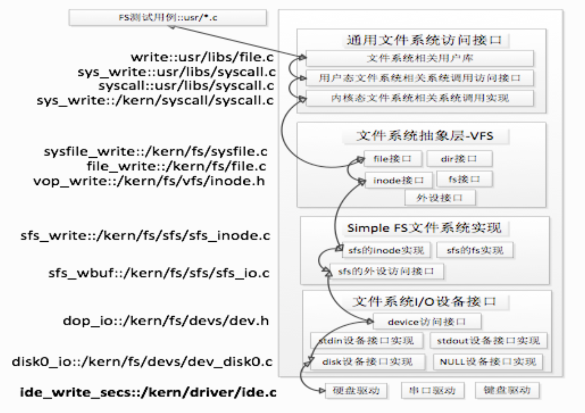
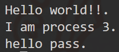
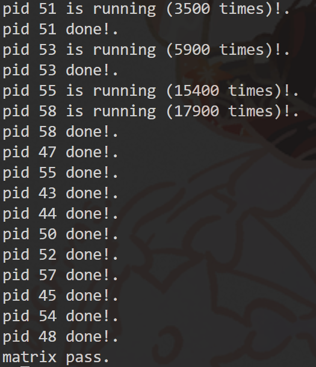
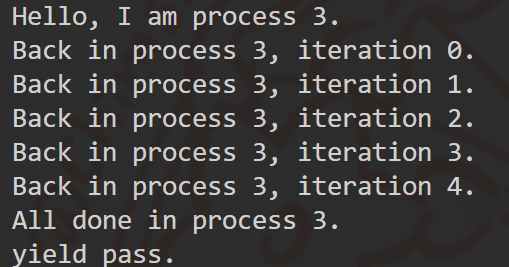

<h1><center>lab8实验报告</center></h1>
<center>组长：谢雯菲  学号：2110803</center>
<center>组员：吴静  学号：2113285</center>
<center>组员：李浩天  学号：2110133</center>

## 练习0：填写已有实验

`本实验依赖实验1/2/3/4/5/6/7。请把你做的实验1/2/3/4/5/6/7的代码填入本实验中代码中有“LAB1”/“LAB2”/“LAB3”/“LAB4”/“LAB5”/“LAB6” /“LAB7”的注释相应部分。并确保编译通过。注意：为了能够正确执行lab8的测试应用程序，可能需对已完成的实验1/2/3/4/5/6/7的代码进行进一步改进。`

### `alloc_proc()`函数

在`alloc_proc()`函数中需要对文件结构的指针进行初始化，即将`proc->filesp`赋值为`NULL`。

修改后的`alloc_proc()`函数如下所示：
```C
static struct proc_struct *
alloc_proc(void) {
    struct proc_struct *proc = kmalloc(sizeof(struct proc_struct));
    if (proc != NULL) {
    //LAB4:EXERCISE1 YOUR CODE
    proc->state = PROC_UNINIT;//设置进程为未初始化状态
    proc->pid = -1;          //未初始化的进程id=-1
    proc->runs = 0;          //初始化时间片
    proc->kstack = 0;      //初始化内存栈的地址
    proc->need_resched = 0;   //是否需要调度设为不需要
    proc->parent = NULL;      //置空父节点
    proc->mm = NULL;      //置空虚拟内存
    memset(&(proc->context), 0, sizeof(struct context));//初始化上下文
    proc->tf = NULL;      //中断帧指针设置为空
    proc->cr3 = boot_cr3;      //页目录设为内核页目录表的基址
    proc->flags = 0;      //初始化标志位
    memset(proc->name, 0, PROC_NAME_LEN);//置空进程名
     //LAB5 YOUR CODE : (update LAB4 steps)
    proc->wait_state = 0;  //初始化进程等待状态  
    proc->cptr = proc->optr = proc->yptr = NULL;//进程相关指针初始化
    //LAB6 YOUR CODE : (update LAB5 steps)
    proc->rq = NULL;
    proc->run_link.prev = proc->run_link.next = NULL;
    proc->time_slice = 0;
    proc->lab6_run_pool.left = proc->lab6_run_pool.right = proc->lab6_run_pool.parent = NULL;
    proc->lab6_stride = 0;
    proc->lab6_priority = 0;
     //LAB8 YOUR CODE : (update LAB6 steps)
    proc->filesp = NULL;
    }
    return proc;
}
```

### `proc_run()`函数

在`proc_run()`函数中，当进程进行上下文切换，即切换到另一个进程运行时，由于不同的进程可能有不同的页表，其虚拟地址到物理地址的映射关系可能会发生变化。因此，在进行进程切换时，需要刷新TLB，以确保TLB中的映射关系与当前运行的进程的页表保持一致。

根据提示，修改后的`proc_run()`函数如下所示：
```C
void
proc_run(struct proc_struct *proc) {
    if (proc != current) {
         // LAB4:EXERCISE3 YOUR CODE
        bool intr_flag;
        struct proc_struct *prev = current; 
        //用于标识当前进程的进程控制块
        struct proc_struct *next = proc;
        //用于标识要切换的进程的进程控制块
        local_intr_save(intr_flag);
        //确保在调度函数执行期间，不会被中断打断
        {
            current = proc;
            //将当前运行的进程设置为要切换过去的进程
            lcr3(next->cr3);
            //将页表换成新进程的页表
            switch_to(&(prev->context), &(next->context));
            //使用switch_to切换到新进程
        }
        local_intr_restore(intr_flag);
        //恢复中断
        //LAB8 YOUR CODE : (update LAB4 steps)
        flush_tlb();
    }
}
```

## 练习1: 完成读文件操作的实现（需要编码）

`首先了解打开文件的处理流程，然后参考本实验后续的文件读写操作的过程分析，填写在 kern/fs/sfs/sfs_inode.c中 的sfs_io_nolock()函数，实现读文件中数据的代码。`

### 打开文件的处理流程

通过学习得知ucore的文件系统总体如下图所示：



一个用户态程序想要执行打开文件的操作的流程为：用户态程序->系统库函数->内核态系统调用->文件系统抽象层处理->SFS文件系统层处理。

#### 用户态程序调用系统库函数

在`user\libs\file.c`代码中定义了用户态程序对文件可以调用的系统库函数。当用户态程序想要打开文件时，会调用`open()`函数，该函数进一步调用`sys_open()`的系统库函数，从而进一步调用`syscall`引起系统调用进入到内核态。

#### 内核态处理

内核调用`sys_open()`函数，进一步调用`sysfile_open()`，完成把位于用户空间的文件路径字符串拷贝到内核空间的操作，最后调用了`file_open()`函数进入文件系统抽象层的处理。

#### 文件系统抽象层处理

`file_open()`函数给即将打开的文件分配一个file数据结构的变量，这个变量其实是current->fs_struct->filemap[]数组中的一个还没用于打开文件的空闲元素。这个元素的索引值最后会返回到用户进程并赋值给变量fd。也就是说这个函数给当前用户进程分配了一个file数据结构的变量，还没有找到对应的文件索引节点。

随后，`file_open()`函数调用`vfs_open()`函数找到path指出的文件所对应的基于inode数据结构的在抽象文件系统中的索引节点。该函数完成了以下两件事情：
1. 通过`vfs_lookup()`找到path对应文件的inode
2. 调用`vop_open()`函数打开文件

其中，`vfs_lookup()`函数是一个针对目录的操作函数，它会调用`vop_lookup()`函数来找到SFS文件系统中的目录下的文件。

在这个流程中，有大量以vop开头的函数，它们都通过一些宏和函数的转发，最后变成对inode结构体里的inode_ops结构体的“成员函数”的调用，也就是会进一步调用对sfs文件系统操作的函数。

#### SFS文件系统层的处理流程

在`kern\fs\sfs\sfs_inode.c`中的`sfs_node_dirops`变量定义了`.vop_lookup = sfs_lookup`，所以到了SFS文件系统层时会调用`sfs_lookup()`函数。

`sfs_lookup()`函数会解析传入的目录DIR的路径，以“/”为分隔符，从左至右逐一分解path获得各个子目录和最终文件对应的inode节点。其调用`sfs_lookup_once()`函数查找根目录下的文件sfs_filetest1对应的inode节点。当无法分解path后，就意味着找到了对应的inode节点。

`sfs_lookup_once()`函数进一步调用`sfs_dirent_search_nolock()`函数来查找与路径名匹配的目录项，如果找到目录项，则根据目录项中记录的inode所处的数据块索引值找到路径名对应的SFS磁盘inode，读入SFS磁盘inode对的内容，创建SFS内存inode（将索引值存到slot，将磁盘inode号存到ino_store）。

之后，文件相应的索引节点值会传回文件系统抽象层中的`file_open()`函数，该函数之后会完善file结构的变量，并将要打开的文件对应的文件结构的变量状态设为“打开”。

### 读写文件的处理流程

读写文件总体的流程与打开文件类似：用户态程序->系统库函数->内核态系统调用->文件系统抽象层处理->SFS文件系统层处理。

#### 用户态程序调用系统库函数

拿读文件举例，用户态程序调用系统库函数`read()`，该函数进一步调用`sys_read()`函数，从而调用`syscall`引起系统调用进入到内核态。

#### 内核态处理

到了内核态以后，通过中断处理例程，会调用到`sys_read()`内核函数，并进一步调用`sysfile_read()`内核函数，进入到文件系统抽象层处理流程完成进一步读文件的操作。

#### 文件系统抽象层处理

`sysfile_read()`函数循环读取文件，每次读取buffer大小。每次循环中先检查剩余部分大小，若其小于4096字节，则只读取剩余部分的大小。然后调用`file_read()`函数将文件内容读取到buffer中，alen为实际大小。

`file_read()`函数首先调用`fd2file()`函数找到对应的file结构，并检查是否可读。调用`filemap_acquire()`函数使打开这个文件的计数加1。调用`vop_read()`函数将文件内容读到iob中。调整文件指针偏移量pos的值，使其向后移动实际读到的字节数`iobuf_used(iob)`。最后调用`filemap_release()`函数使打开这个文件的计数减1，若打开计数为0，则释放file。

#### SFS文件系统层的处理流程

在上述文件系统抽象层中调用的`vop_read()`函数实际上是对`sfs_read()`函数的包装。在`sfs_read()`函数中，调用了`sys_io()`函数。`sfs_io()`函数先找到inode对应的sfs和sin，然后调用`sfs_io_nolock()`函数进行读取文件操作，最后调用`iobuf_skip()`函数调整iobuf的指针。

最后函数返回后，文件系统抽象层的`sysfile_read()`函数继续调用`copy_to_user()`函数将读到的内容拷贝到用户的内存空间中，调整各变量以进行下一次循环读取，直至指定长度读取完成。最后函数调用层层返回至用户程序，用户程序收到了读到的文件内容。

### `sfs_io_nolock()`函数实现

在`sfs_io_nolock()`函数中需要完成以下操作：
1. 先计算一些辅助变量，并处理一些特殊情况（比如越界），然后有sfs_buf_op = sfs_rbuf,sfs_block_op = sfs_rblock，设置读取的函数操作。
2. 接着进行实际操作，先处理起始的没有对齐到块的部分，再以块为单位循环处理中间的部分，最后处理末尾剩余的部分。
3. 每部分中都调用`sfs_bmap_load_nolock()`函数得到blkno对应的inode编号，并调用`sfs_rbuf()`或`sfs_rblock()`函数读取数据（中间部分调用`sfs_rblock()`，起始和末尾部分调用`sfs_rbuf()`），调整相关变量。
4. 完成后如果offset + alen > din->fileinfo.size（即导致文件大小增加，只有写文件时会出现这种情况），则调整文件大小为offset + alen并设置dirty变量。

根据提示，需要用到`sfs_bmap_load_nolock()`、`sfs_buf_op()`和`sfs_block_op()`函数。

#### `sfs_bmap_load_nolock()`函数

该函数的源码及注释如下所示：

```C
 /* sfs_bmap_load_nolock - 根据目录的 inode 和 inode 中块的逻辑索引，查找磁盘块的编号。
 * @sfs:        SFS 文件系统
 * @sin:        内存中的 SFS inode
 * @index:      inode 中磁盘块的逻辑索引
 * @ino_store:  存储磁盘块编号的指针
 */
static int
sfs_bmap_load_nolock(struct sfs_fs *sfs, struct sfs_inode *sin, uint32_t index, uint32_t *ino_store)
{
    // 获取指向该 inode 的磁盘表示的指针
    struct sfs_disk_inode *din = sin->din;

    // 断言所请求的索引不超过当前 inode 的块数
    assert(index <= din->blocks);

    int ret;
    uint32_t ino;
    // 确定是否需要创建新块（写入新的块？）
    bool create = (index == din->blocks);

    // 获取给定索引处的块映射，如果需要创建块，则创建新块
    if ((ret = sfs_bmap_get_nolock(sfs, sin, index, create, &ino)) != 0)
    {
        return ret;
    }

    // 断言获取到的块号确实在使用中
    assert(sfs_block_inuse(sfs, ino));

    // 如果需要创建块，则增加当前 inode 的块数
    if (create)
    {
        din->blocks++;
    }

    // 如果 ino_store 指针不为空，则将获取到的块号存储到指针指向的位置
    if (ino_store != NULL)
    {
        *ino_store = ino;
    }

    // 返回成功加载块映射的结果
    return 0;
}
```

该函数会将对应sfs_inode的第index个索引指向的block块的索引值取出存到相应的指针指向的单元（ino_store）。它进一步调用`sfs_bmap_get_nolock()`函数来完成相应的操作。

#### `sfs_buf_op()`和`sfs_block_op()`函数

这两个函数实际上是函数的指针，会在`sfs_bmap_load_nolock()`函数的前半部分被赋值。如果是读操作，`sfs_buf_op()`函数会被赋值为`sfs_rbuf()`函数，`sfs_block_op()`函数会被赋值为`sfs_rblock()`函数；如果是写操作，`sfs_buf_op()`函数会被赋值为`sfs_wbuf()`函数，`sfs_block_op()`函数会被赋值为`sfs_wblock()`函数。

##### `sfs_rbuf()`函数和`sfs_rblock()`函数

拿读操作举例，`sfs_rbuf()`函数的代码及注释如下所示：

```C
/* 
 * sfs_rbuf - 用于读取一个磁盘块的基本块级I/O例程（非块对齐和非块I/O），使用 sfs->sfs_buffer，
 *            并在Rd/Wr磁盘块时进行互斥处理的锁保护
 * @sfs:    将要进行处理的 sfs_fs 结构体
 * @buf:    用于读取的缓冲区
 * @len:    需要读取的长度
 * @blkno:  磁盘块的编号
 * @offset: 磁盘块内容中的偏移量
 */
int
sfs_rbuf(struct sfs_fs *sfs, void *buf, size_t len, uint32_t blkno, off_t offset) {
    //使用断言确保参数合法性，即偏移量在有效范围内
    assert(offset >= 0 && offset < SFS_BLKSIZE && offset + len <= SFS_BLKSIZE);
    int ret;
    //锁定SFS文件系统，确保在执行I/O操作时互斥
    lock_sfs_io(sfs);
    {
        //调用 sfs_rwblock_nolock 函数来读取指定磁盘块的内容到 SFS 文件系统结构体中的缓冲区 sfs_buffer。
        //如果读取成功（返回值为0），则将缓冲区的内容从指定偏移量开始复制到目标缓冲区 buf 中。
        if ((ret = sfs_rwblock_nolock(sfs, sfs->sfs_buffer, blkno, 0, 1)) == 0) {
            memcpy(buf, sfs->sfs_buffer + offset, len);
        }
    }
    //解锁
    unlock_sfs_io(sfs);
    return ret;
}
```

`sfs_rblock()`函数进一步调用`sfs_rwblock()`函数，该函数代码及注释如下所示：
```C
/* 
 * sfs_rwblock - 用于读取/写入 N 个磁盘块的基本块级 I/O 例程，
 *               并在 Rd/Wr 磁盘块时进行互斥处理的锁保护
 * @sfs:    将要进行处理的 sfs_fs 结构体
 * @buf:    用于读取/写入的缓冲区
 * @blkno:  磁盘块的编号
 * @nblks:  读取/写入的磁盘块数量
 * @write:  布尔值: 读取 - 0 或写入 - 1
 */
static int
sfs_rwblock(struct sfs_fs *sfs, void *buf, uint32_t blkno, uint32_t nblks, bool write) {
    int ret = 0;
    //锁定SFS文件系统
    lock_sfs_io(sfs);
    {
        //循环处理每个磁盘块，直到读取/写入完指定数量的磁盘块
        while (nblks != 0) {
            //调用 sfs_rwblock_nolock 函数来读取或写入一个磁盘块的内容。
            //如果读取/写入操作失败（返回值不为0），则退出循环。
            if ((ret = sfs_rwblock_nolock(sfs, buf, blkno, write, 1)) != 0) {
                break;
            }
            //更新磁盘块编号、剩余磁盘块数量和缓冲区指针，以处理下一个磁盘块。
            blkno ++, nblks --;
            buf += SFS_BLKSIZE;
        }
    }
    //解锁
    unlock_sfs_io(sfs);
    return ret;
}
```

这两个函数最终都调用`sfs_rwblock_nolock()`函数完成操作，而`sfs_rwblock_nolock()`函数调用`dop_io`->`disk0_io`->`disk0_read_blks_nolock`->`ide_read_secs`完成对磁盘的操作。

#### `sfs_io_nolock()`函数代码实现

根据提示，函数主要分为三个部分实现：
1. 如果偏移量与第一个块不对齐，从偏移位置读取/写入一些内容直到第一个块的末尾
2. 读/写对齐的块
3. 如果结束位置与最后一个块不对齐，从最后一个块的开始位置读取/写入一些内容到最后一个块的 (endpos % SFS_BLKSIZE) 处

函数代码最终的实现及注释如下所示：
```C
static int
sfs_io_nolock(struct sfs_fs *sfs, struct sfs_inode *sin, void *buf, off_t offset, size_t *alenp, bool write)
{
    ............

    // LAB8:EXERCISE1 YOUR CODE HINT: 2110803

    //(1)blkoff为非对齐的起始块中需要操作的偏移量
    //判断是否需要操作
    if ((blkoff = offset % SFS_BLKSIZE) != 0){
        //得到起始块中要进行操作的数据长度
        //nblks为0说明为最后一块
        //如果不是最后一块计算：块大小-操作偏移量
        //如果是最后一块计算：结束长度-总偏移量
        size = (nblks != 0) ? (SFS_BLKSIZE - blkoff) : (endpos-offset);
        //获取这些数据块对应到磁盘上的数据块的inode号
        if((ret = sfs_bmap_load_nolock(sfs, sin, blkno, &ino)) != 0){
            goto out;
        }
        //对缓冲区进行读或写操作
        if((ret = sfs_buf_op(sfs, buf, size, ino, blkoff)) != 0){
            goto out;
        }
        //已经完成读写的数据长度
        alen += size;
        //如果这是最后操作的块，结束
        if(nblks == 0){
            goto out;
        }
        //否则，更新缓冲区
        buf += size;
        blkno++;
        nblks--;
    }
    //（2）读取起始块后对齐块的数据
    //将中间部分的数据分为一块一块的大小，一块一块操作
    size = SFS_BLKSIZE;
    //从起始块后一块开始到对齐的最后一块
    while(nblks != 0){
        //获取磁盘上块的编号
        if((ret = sfs_bmap_load_nolock(sfs, sin, blkno, &ino)) != 0){
            goto out;
        }
        //对数据块进行读或写操作
        if((ret = sfs_block_op(sfs, buf, ino, 1)) != 0){
            goto out;
        }
        //更新
        alen += size;
        buf += size;
        blkno ++;
        nblks --;
    }
    //（3）如果有非对齐操作的最后一块
    if((size = endpos % SFS_BLKSIZE) != 0){
        //获取磁盘上的块号
        if((ret = sfs_bmap_load_nolock(sfs, sin, blkno, &ino)) != 0){
            goto out;
        }
        //缓冲区读写操作
        if((ret = sfs_buf_op(sfs, buf, size, ino, 0)) != 0){
            goto out;
        }
        //更新
        alen += size;
    }

out:
    ............

    return ret;
}
```

## 练习2: 完成基于文件系统的执行程序机制的实现（需要编码）

本次练习将从提示和lab5`load_icode`代码入手，提示如下：

```c++
    /* (1) create a new mm for current process
     * (2) create a new PDT, and mm->pgdir= kernel virtual addr of PDT
     * (3) copy TEXT/DATA/BSS parts in binary to memory space of process
     *    (3.1) read raw data content in file and resolve elfhdr
     *    (3.2) read raw data content in file and resolve proghdr based on info in elfhdr
     *    (3.3) call mm_map to build vma related to TEXT/DATA
     *    (3.4) call pgdir_alloc_page to allocate page for TEXT/DATA, read contents in file
     *          and copy them into the new allocated pages
     *    (3.5) call pgdir_alloc_page to allocate pages for BSS, memset zero in these pages
     * (4) call mm_map to setup user stack, and put parameters into user stack
     * (5) setup current process's mm, cr3, reset pgidr (using lcr3 MARCO)
     * (6) setup uargc and uargv in user stacks
     * (7) setup trapframe for user environment
     * (8) if up steps failed, you should cleanup the env.
     */
```

### (1) create a new mm for current process

调用`mm_create`函数来申请进程的内存管理数据结构mm所需内存空间，并对mm进行初始化。

代码如下：

```c++
    struct mm_struct *mm;
    if ((mm = mm_create()) == NULL)
    {
        goto bad_mm;
    }
```

首先使用`mm_create`函数创建了一个新的`mm_struct`结构体，同时进行了错误检查，如果最后创建的结构题返回值为`null`，则报错。

`mm_create`函数如下：

```c++
// mm_create -  alloc a mm_struct & initialize it.
struct mm_struct *
mm_create(void) {
    struct mm_struct *mm = kmalloc(sizeof(struct mm_struct));

    if (mm != NULL) {
        list_init(&(mm->mmap_list));
        mm->mmap_cache = NULL;
        mm->pgdir = NULL;
        mm->map_count = 0;

        if (swap_init_ok) swap_init_mm(mm);
        else mm->sm_priv = NULL;
        
        set_mm_count(mm, 0);
        sem_init(&(mm->mm_sem), 1);
    }    
    return mm;
}
```

该函数具体作用是分配一个`mm_struct`结构体并且进行初始化。

### (2) create a new PDT, and mm->pgdir= kernel virtual addr of PDT

调用`setup_pgdir`来申请一个页目录表所需的一个页大小的内存空间，并把描述`ucore`内核虚空间映射的内核页表的内容拷贝到此新目录表中，最后让`mm->pgdir`指向此页目录表。

代码如下：

```c++
    if (setup_pgdir(mm) != 0)
    {
        goto bad_pgdir_cleanup_mm;
    }
```

调用`setup_pgdir`函数创建一个新的页目录表，并将 `mm->pgdir` 设置为页目录表的内核虚拟地址。

`setup_pgdir`函数如下：

```c++
// setup_pgdir - alloc one page as PDT
static int
setup_pgdir(struct mm_struct *mm)
{
    struct Page *page;
    if ((page = alloc_page()) == NULL)
    {
        return -E_NO_MEM;
    }
    pde_t *pgdir = page2kva(page);
    memcpy(pgdir, boot_pgdir, PGSIZE);

    mm->pgdir = pgdir;
    return 0;
}
```

该函数的作用是分配一个页面作为页目录表。

### (3) copy TEXT/DATA/BSS parts in binary to memory space of process

将磁盘中的文件加载到内存中。

这一步是要将将二进制文件中的 `TEXT/DATA/BSS` 部分复制到进程的内存空间；

注意这里和lab5有一点不同，lab5的`load_icode`中传递了二进制文件`binary`和大小`size`，但是本次实验传递的是文件描述符 `fd`，参数数量 `argc` 和参数列表 `kargv`，所以在这一步的具体实现需要做变动。

#### (3.0) preparations

在做具体实现前，首先先对`elf`文件头和程序段头做基础了解。

##### elf文件头格式

```c++
#define ELF_MAGIC   0x464C457FU         // "\x7FELF" in little endian

/* file header */
struct elfhdr {
    uint32_t e_magic;     // must equal ELF_MAGIC
    uint8_t e_elf[12];
    uint16_t e_type;      // 1=relocatable, 2=executable, 3=shared object, 4=core image
    uint16_t e_machine;   // 3=x86, 4=68K, etc.
    uint32_t e_version;   // file version, always 1
    uint64_t e_entry;     // entry point if executable
    uint64_t e_phoff;     // file position of program header or 0
    uint64_t e_shoff;     // file position of section header or 0
    uint32_t e_flags;     // architecture-specific flags, usually 0
    uint16_t e_ehsize;    // size of this elf header
    uint16_t e_phentsize; // size of an entry in program header
    uint16_t e_phnum;     // number of entries in program header or 0
    uint16_t e_shentsize; // size of an entry in section header
    uint16_t e_shnum;     // number of entries in section header or 0
    uint16_t e_shstrndx;  // section number that contains section name strings
};
```

下面是对其各个字段的解释：

- `e_magic`: ELF 文件标识，必须等于 ELF_MAGIC。
- `e_elf[12]`: ELF 文件类型的额外标识信息。
- `e_type`: 指定 ELF 文件类型
  - 1 表示可重定位文件
  - 2 表示可执行文件
  - 3 表示共享对象
  - 4 表示核心转储文件。

- `e_machine`: 指定了目标体系结构的类型
  - 3 代表 x86
  - 4 代表 68K

- `e_version`: 文件版本号，通常为 1
- `e_entry`: 如果是可执行文件，则表示程序的入口点
- `e_phoff`: 程序头表的文件偏移量，如果没有程序头表则为 0
- `e_shoff`: 节头表的文件偏移量，如果没有节头表则为 0
- `e_flags`: 体系结构相关的标志，通常为 0
- `e_ehsize`: ELF 头的大小（字节）
- `e_phentsize`: 程序头表中每个条目的大小
- `e_phnum`: 程序头表中的条目数，如果没有程序头表则为 0
- `e_shentsize`: 节头表中每个条目的大小
- `e_shnum`: 节头表中的条目数，如果没有节头表则为 0
- `e_shstrndx`: 包含节名称字符串的节的索引号

##### 程序段头文件格式

```c++
/* program section header */
struct proghdr {
    uint32_t p_type;   // loadable code or data, dynamic linking info,etc.
    uint32_t p_flags;  // read/write/execute bits
    uint64_t p_offset; // file offset of segment
    uint64_t p_va;     // virtual address to map segment
    uint64_t p_pa;     // physical address, not used
    uint64_t p_filesz; // size of segment in file
    uint64_t p_memsz;  // size of segment in memory (bigger if contains bss）
    uint64_t p_align;  // required alignment, invariably hardware page size
};

/* values for Proghdr::p_type */
#define ELF_PT_LOAD                     1

/* flag bits for Proghdr::p_flags */
#define ELF_PF_X                        1
#define ELF_PF_W                        2
#define ELF_PF_R                        4
```

以下是对每个字段的解释：

- `p_type`: 指定段的类型，可能是可加载的代码或数据，动态链接信息等
  - 程序中给了一种类型`ELF_PT_LOAD`，表示可加载

- `p_flags`: 标识段的属性
  - `ELF_PF_R`表示读
  - `ELF_PF_W`表示写
  - `ELF_PF_X`表示可执行

- `p_offset`: 段在文件中的偏移量，指示段在 ELF 文件中的位置
- `p_va`: 段在虚拟地址空间中的起始地址，用于映射到进程的内存
- `p_pa`: 物理地址，通常不使用
- `p_filesz`: 段在文件中的大小，表示段在 ELF 文件中占据的空间大小
- `p_memsz`: 段在内存中的大小，表示段加载到内存后占据的空间大小，如果包含未初始化数据 (BSS)，则通常会比文件大小要大
- `p_align`: 段的对齐要求，通常等于硬件页面大小

接下来，由于本次步骤中的几个步骤都会用上`load_icode_read`函数，首先先来解析这个函数的作用。

##### load_icode_read()

函数原型如下：

```c++
static int
load_icode_read(int fd, void *buf, size_t len, off_t offset)
{
    int ret;
    if ((ret = sysfile_seek(fd, offset, LSEEK_SET)) != 0)
    {
        return ret;
    }
    if ((ret = sysfile_read(fd, buf, len)) != len)
    {
        return (ret < 0) ? ret : -1;
    }
    return 0;
}
```

该函数接收四个参数：

- 文件描述符 `fd`
- 指向缓冲区的指针 `buf`
- 读取的长度 `len`
- 读取的偏移量 `offset`。

该函数的作用是从文件中读取数据并将其存储到内存缓冲区buff中，具体步骤如下：

1. 使用 `sysfile_seek` 函数将文件描述符 `fd` 设置到指定的 `offset`

   `sysfile`函数：

   ```c++
   //kern/fs/sysfile.c
   int sysfile_seek(int fd, off_t pos, int whence)
   {
       return file_seek(fd, pos, whence);
   }
   ```

   `file_seek`函数如下：

   ```c++
   // seek file
   int file_seek(int fd, off_t pos, int whence)
   {
       struct stat __stat, *stat = &__stat;
       int ret;
       struct file *file;
       if ((ret = fd2file(fd, &file)) != 0)
       {
           return ret;
       }
       fd_array_acquire(file);
   
       switch (whence)
       {
       case LSEEK_SET:
           break;
       case LSEEK_CUR:
           pos += file->pos;
           break;
       case LSEEK_END:
           if ((ret = vop_fstat(file->node, stat)) == 0)
           {
               pos += stat->st_size;
           }
           break;
       default:
           ret = -E_INVAL;
       }
   
       if (ret == 0)
       {
           if ((ret = vop_tryseek(file->node, pos)) == 0)
           {
               file->pos = pos;
           }
           //    cprintf("file_seek, pos=%d, whence=%d, ret=%d\n", pos, whence, ret);
       }
       fd_array_release(file);
       return ret;
   }
   ```

   该函数接收三个参数：文件描述符`fd`，偏移量`pos`和定位的起始位置`whence`，其中`whence`有三个选项：

   - 文件开头（`LSEEK_SET`）
   - 当前位置（`LSEEK_CUR`）
   - 文件结尾（`LSEEK_END`）

   该函数的作用是更改文件操作的起始点

2. 使用 `sysfile_read` 函数从文件中读取长度为 `len` 的数据，将其存储到 `buf` 指向的内存缓冲区中。

   - 如果读取的数据长度不等于 `len`，则返回一个相应的错误代码
   - 如果读取出现错误，返回-1
   - 如果读取成功，返回 0 

   `sysfile_read`函数如下：

   ```c++
   /* sysfile_read - read file */
   int sysfile_read(int fd, void *base, size_t len)
   {
       struct mm_struct *mm = current->mm;
       //检查读取长度是否为0
       if (len == 0)
       {
           return 0;
       }
       //检查文件是否可读
       if (!file_testfd(fd, 1, 0))
       {
           return -E_INVAL;
       }
       //分配buffer空间，调用kmalloc函数分配4096字节的buffer空间
       void *buffer;
       if ((buffer = kmalloc(IOBUF_SIZE)) == NULL)
       {
           return -E_NO_MEM;
       }
   
       int ret = 0;
       size_t copied = 0, alen;
       //循环读取文件
       while (len != 0)
       {
           //每次读取buffer大小
           //如果剩余部分小于4096字节，则只读取剩余部分
           if ((alen = IOBUF_SIZE) > len)
           {
               alen = len;
           }
           //调用file_read函数将文件内容读取到buffer中，alen为实际大小
           ret = file_read(fd, buffer, alen, &alen);
           if (alen != 0)
           {
               lock_mm(mm);
               {
                   //调用copy_to_user函数将读取到的内容拷贝到用户的内存空间中
                   if (copy_to_user(mm, base, buffer, alen))
                   {
                       assert(len >= alen);
                       base += alen, len -= alen, copied += alen;
                   }
                   else if (ret == 0)
                   {
                       ret = -E_INVAL;
                   }
               }
               unlock_mm(mm);
           }
           if (ret != 0 || alen == 0)
           {
               goto out;
           }
       }
   //函数调用层返回至用户程序
   out:
       kfree(buffer);
       if (copied != 0)
       {
           return copied;
       }
       return ret;
   }
   ```

   这个函数的作用是从指定文件描述符对应的文件中读取数据到用户提供的缓存区`base`中

***于是可以得到`load_icode_read`函数的作用是读取程序文件的原始数据内容：从指定文件描述符`fd`对应的文件中从`offset`偏移量开始读取`len`长度的字节到`buf`中。***

##### mm_map()

函数原型如下：

```c++
int
mm_map(struct mm_struct *mm, uintptr_t addr, size_t len, uint32_t vm_flags,
       struct vma_struct **vma_store) {
    uintptr_t start = ROUNDDOWN(addr, PGSIZE), end = ROUNDUP(addr + len, PGSIZE);
    if (!USER_ACCESS(start, end)) {
        return -E_INVAL;
    }

    assert(mm != NULL);

    int ret = -E_INVAL;

    struct vma_struct *vma;
    if ((vma = find_vma(mm, start)) != NULL && end > vma->vm_start) {
        goto out;
    }
    ret = -E_NO_MEM;

    if ((vma = vma_create(start, end, vm_flags)) == NULL) {
        goto out;
    }
    insert_vma_struct(mm, vma);
    if (vma_store != NULL) {
        *vma_store = vma;
    }
    ret = 0;

out:
    return ret;
}
```

具体操作如下：

1. 确保地址范围与页对齐：根据给定的地址和长度，对地址进行向下取整（`ROUNDDOWN`）并对长度进行向上取整（`ROUNDUP`）
2. 检查所提供的地址范围是否属于用户空间
3. 查找`mm`中的`vma`是否与新的`vma`区域重叠
4. 调用`vma_create`创建一个新的`vma`
5. 将新`vma`插入到进程的`vma`列表中
6. 将新的`vma`结构体存储到 `vma_store` 指向的位置

***于是可以得到`mm_map`函数的作用是根据`addr`和`len`创建新的虚拟内存区域，并将其加入到`mm`的虚拟内存列表中，同时存储到`vma_store`指向的位置。***

##### pgdir_alloc_page()

函数原型如下：

```c++
//kern/mm/pmm.c

// pgdir_alloc_page - call alloc_page & page_insert functions to
//                  - allocate a page size memory & setup an addr map
//                  - pa<->la with linear address la and the PDT pgdir
struct Page *pgdir_alloc_page(pde_t *pgdir, uintptr_t la, uint32_t perm) {
    struct Page *page = alloc_page();
    if (page != NULL) {
        if (page_insert(pgdir, page, la, perm) != 0) {
            free_page(page);
            return NULL;
        }
        if (swap_init_ok) {
            if (check_mm_struct != NULL) {
                swap_map_swappable(check_mm_struct, la, page, 0);
                page->pra_vaddr = la;
                assert(page_ref(page) == 1);
                // cprintf("get No. %d  page: pra_vaddr %x, pra_link.prev %x,
                // pra_link_next %x in pgdir_alloc_page\n", (page-pages),
                // page->pra_vaddr,page->pra_page_link.prev,
                // page->pra_page_link.next);
            } else {  // now current is existed, should fix it in the future
                // swap_map_swappable(current->mm, la, page, 0);
                // page->pra_vaddr=la;
                // assert(page_ref(page) == 1);
                // panic("pgdir_alloc_page: no pages. now current is existed,
                // should fix it in the future\n");
            }
        }
    }

    return page;
}
```

***该函数作用是为给定的页目录表`pgdir`分配一个物理页面，页面的访问权限是`perm`，并在给定的线性地址la处设置地址映射关系。***

#### (3.1) read raw data content in file and resolve elfhdr

代码如下：

```c++
    struct Page *page;

    struct elfhdr __elf, *elf = &__elf;
    if ((ret = load_icode_read(fd, elf, sizeof(struct elfhdr), 0)) != 0)
    {
        goto bad_elf_cleanup_pgdir;
    }

    // 通过elf魔数判断文件是否有效
    if (elf->e_magic != ELF_MAGIC)
    {
        ret = -E_INVAL_ELF;
        goto bad_elf_cleanup_pgdir;
    }
```

逻辑如下：

1. 创建一个指向`elfhdr`结构体的指针`elf`
2. 调用`load_icode_read`函数将文件开头`elfhdr`结构大小的数据赋值给该指针
3. 通过`elf->e_magic`判断该文件是否有效
   - `elf->e_magic==ELF_MAGIC`则说明该文件有效，没有损坏
   - 反之进入`bad_elf_cleanup_pgdir`部分

#### (3.2) read raw data content in file and resolve proghdr based on info in elfhdr

代码如下：

```c++
	struct proghdr __ph, *ph = &__ph;
    uint32_t vm_flags, perm, phnum;
    for (phnum = 0; phnum < elf->e_phnum; phnum++)
    {
        off_t phoff = elf->e_phoff + sizeof(struct proghdr) * phnum;
        if ((ret = load_icode_read(fd, ph, sizeof(struct proghdr), phoff)) != 0)
        {
            goto bad_cleanup_mmap;
        }
        // find every program section headers
        if (ph->p_type != ELF_PT_LOAD)
        {
            continue;
        }
        if (ph->p_filesz > ph->p_memsz)
        {
            ret = -E_INVAL_ELF;
            goto bad_cleanup_mmap;
        }
        if (ph->p_filesz == 0)
        {
            // continue ;
        }
```

逻辑如下：

1. 创建一个指向`proghdr`结构体的指针`ph`
2. `phnum`用于遍历`elf->e_phnum`（程序头表中的条目数）
3. `phoff`表示每一个条目中文件偏移量：
   - 每一个条目数所占的空间是`struct proghdr`大小
   - 本条目前面总共有`phnum`个条目
   - 再加上程序头表的文件偏移量`elf->e_phoff`即可得到
4. 调用`load_icode_read`函数将文件开头偏移量`phoff`开始的`proghdr`结构大小的数据赋值给该指针
5. 进行一些检查：
   - 程序段的类型是否是可加载的
   - 段在 ELF 文件中占据的空间大小是否不大于段加载到内存后占据的空间大小
   - 段在 ELF 文件中占据的空间大小是否不等于0

#### (3.3) call mm_map to build vma related to TEXT/DATA

代码如下：

```c++
		uint32_t vm_flags=0, perm=PTE_U | PTE_V;

        if (ph->p_flags & ELF_PF_X)
            vm_flags |= VM_EXEC;
        if (ph->p_flags & ELF_PF_W)
            vm_flags |= VM_WRITE;
        if (ph->p_flags & ELF_PF_R)
            vm_flags |= VM_READ;
        // modify the perm bits here for RISC-V
        if (vm_flags & VM_READ)
            perm |= PTE_R;
        if (vm_flags & VM_WRITE)
            perm |= (PTE_W | PTE_R);
        if (vm_flags & VM_EXEC)
            perm |= PTE_X;
        if ((ret = mm_map(mm, ph->p_va, ph->p_memsz, vm_flags, NULL)) != 0)
        {
            goto bad_cleanup_mmap;
        }
```

逻辑如下：

1. `vm_flags` ：表示虚拟内存区域的标志位（flags），初始化为0，表示还没有赋予权限

   - 权限定义如下：

     ```c++
     //kern/mm/vmm.h
     
     #define VM_READ                 0x00000001
     #define VM_WRITE                0x00000002
     #define VM_EXEC                 0x00000004
     #define VM_STACK                0x00000008
     ```

   `perm` ：表示页面权限，初始化为`PTE_U`和`PTE_V`，表示用户权限和可执行权限

   - 权限定义如下：

     ```c++
     //kern/mm/mmu.h
     
     // page table entry (PTE) fields
     #define PTE_V     0x001 // Valid
     #define PTE_R     0x002 // Read
     #define PTE_W     0x004 // Write
     #define PTE_X     0x008 // Execute
     #define PTE_U     0x010 // User
     #define PTE_G     0x020 // Global
     #define PTE_A     0x040 // Accessed
     #define PTE_D     0x080 // Dirty
     #define PTE_SOFT  0x300 // Reserved for Software
     
     #define PAGE_TABLE_DIR (PTE_V)
     #define READ_ONLY (PTE_R | PTE_V)
     #define READ_WRITE (PTE_R | PTE_W | PTE_V)
     #define EXEC_ONLY (PTE_X | PTE_V)
     #define READ_EXEC (PTE_R | PTE_X | PTE_V)
     #define READ_WRITE_EXEC (PTE_R | PTE_W | PTE_X | PTE_V)
     
     #define PTE_USER (PTE_R | PTE_W | PTE_X | PTE_U | PTE_V)
     ```

2. - 如果段属性是可执行的（`ELF_PF_X`），虚拟内存区域的标志位也加上可执行（`VM_EXEC`）
   - 如果段属性是可写的（`ELF_PF_W`），虚拟内存区域的标志位也加上可写（`VM_WRITE`）
   - 如果段属性是可读的（`ELF_PF_R`），虚拟内存区域的标志位也加上可读（`VM_READ`）

3. - 如果该虚拟内存区域是可读的（`VM_READ`），则页面权限也加上可读（`PTE_R`）
   - 如果该虚拟内存区域是可写的（`VM_WRITE`），则页面权限也加上可写（`PTE_W`）
   - 如果该虚拟内存区域是可执行的（`VM_EXEC`），则页面权限也加上可执行（`PTE_X`）

4. 调用`mm_map`函数根据`ph->p_va`（段在虚拟地址空间中的起始地址）和`ph->p_memsz`（段在内存中的大小）创建新的虚拟内存区域并将其链入`mm`中的虚拟内存区域列表，该新建的虚拟内存区域的属性存在`vm_flags`中

#### (3.4) call pgdir_alloc_page to allocate page for TEXT/DATA, read contents in file and copy them into the new allocated pages

为数据段和代码段分配页。

代码如下：

```c++
		off_t offset = ph->p_offset;
        size_t off, size;
        uintptr_t start = ph->p_va;
        uintptr_t end= ph->p_va + ph->p_filesz;
        uintptr_t la = ROUNDDOWN(start, PGSIZE);

        ret = -E_NO_MEM;
        
        while (start < end)
        {
            if ((page = pgdir_alloc_page(mm->pgdir, la, perm)) == NULL)
            {
                ret = -E_NO_MEM;
                goto bad_cleanup_mmap;
            }
            off = start - la, size = PGSIZE - off, la += PGSIZE;
            if (end < la)
            {
                size -= la - end;
            }
            if ((ret = load_icode_read(fd, page2kva(page) + off, size, offset)) != 0)
            {
                goto bad_cleanup_mmap;
            }
            start += size, offset += size;
        }
```

逻辑如下：

1. 首先初始化`offset`为程序段在文件中的偏移量，`start`为加载的程序段的起始虚拟地址，`end`表示加载的程序段的结束虚拟地址
2. 接下来进行程序段的逐页加载：
   - 为`pgdir`分配一个物理页，页面权限是`perm`
   - 计算当前页内的偏移量`off`和剩余空间大小`size`
   - 如果该页的大小超出程序段的实际大小，则减去多余的部分
   - 调用`load_icode_read`函数从`fd`表示的文件中偏移量为`offset`的地址处读取`size`大小的数据到`page2kva(page) + off`中
     - `page2kva(page)`用于将给定的物理页面`page`转换为内核虚拟地址
     - `off`是相对于这个物理页面起始地址的偏移量
     - 虽然起始地址不同但是两个偏移量是相同的，所以两者相加可以得到这个物理页面上对应偏移量处的内核虚拟地址
   - 更新当前加载的位置和文件偏移量

#### (3.5) call pgdir_alloc_page to allocate pages for BSS, memset zero in these pages

为`BSS`段分配页。

代码如下：

```c++
		end = ph->p_va + ph->p_memsz;
        if (start < la)
        {
            /* ph->p_memsz == ph->p_filesz */
            if (start == end)
            {
                continue;
            }
            off = start + PGSIZE - la, size = PGSIZE - off;
            if (end < la)
            {
                size -= la - end;
            }
            memset(page2kva(page) + off, 0, size);
            start += size;
            assert((end < la && start == end) || (end >= la && start == la));
        }
        while (start < end)
        {
            if ((page = pgdir_alloc_page(mm->pgdir, la, perm)) == NULL)
            {
                ret = -E_NO_MEM;
                goto bad_cleanup_mmap;
            }
            off = start - la, size = PGSIZE - off, la += PGSIZE;
            if (end < la)
            {
                size -= la - end;
            }
            memset(page2kva(page) + off, 0, size);
            start += size;
        }
    }
    sysfile_close(fd);
```

逻辑如下：

1. `end`表示程序段在内存中结束的地址
2. `start`表示当前处理的物理页面的起始地址，if段进行了段对齐的操作：如果`start`小于`la`，即条件成立，则需要对未被覆盖到的内存区域填充0
3. 使用循环逐个分配物理页面，将程序段的内容加载到内存中
   - 调用`pgdir_alloc_page` 函数分配一个物理页面，页面权限是`perm`
   - 计算偏移量`off`和大小`size`
   - 判断是否有未被覆盖的内存区域，将该部分填充为0
4. 调用`sysfile_close`函数关闭文件

### (4) call mm_map to setup user stack, and put parameters into user stack

设置用户栈。

代码如下：

```c++
	vm_flags = VM_READ | VM_WRITE | VM_STACK;
    if ((ret = mm_map(mm, USTACKTOP - USTACKSIZE, USTACKSIZE, vm_flags, NULL)) != 0)
    {
        goto bad_cleanup_mmap;
    }
    assert(pgdir_alloc_page(mm->pgdir, USTACKTOP - PGSIZE, PTE_USER) != NULL);
    assert(pgdir_alloc_page(mm->pgdir, USTACKTOP - 2 * PGSIZE, PTE_USER) != NULL);
    assert(pgdir_alloc_page(mm->pgdir, USTACKTOP - 3 * PGSIZE, PTE_USER) != NULL);
    assert(pgdir_alloc_page(mm->pgdir, USTACKTOP - 4 * PGSIZE, PTE_USER) != NULL);
```

逻辑如下：

1. 初始化虚拟内存空间访问权限为可读可写并且该内存区域用作栈
2. 调用`mm_map`函数设置用户栈
3. 调用`pgdir_alloc_page`函数在用户栈顶的不同位置分配了多个页面，并使用 `assert` 断言确保这些页面的分配是成功的，每个页面的权限标志均为 `PTE_USER`，实现了将参数放入用户栈的功能

### (5) setup current process's mm, cr3, reset pgdir (using lcr3 MARCO)

代码如下：

```c++
    mm_count_inc(mm);
    current->mm = mm;
    current->cr3 = PADDR(mm->pgdir);
    lcr3(PADDR(mm->pgdir));
```

逻辑如下：

1. 增加了`mm`的引用计数
2. 将当前进程的地址空间指针设置为`mm`
3. 将当前目录基址寄存器`cr3`的值设置为当前进程页目录表的物理地址
4. 通过`lcr3`汇编指令实现页目录表的加载

### (6) setup uargc and uargv in user stacks

代码如下：

```c++
    uint32_t argv_size = 0, i;
    for (i = 0; i < argc; i++)
    {
        argv_size += strnlen(kargv[i], EXEC_MAX_ARG_LEN + 1) + 1;
    }

    uintptr_t stacktop = USTACKTOP - (argv_size / sizeof(long) + 1) * sizeof(long);
    char **uargv = (char **)(stacktop - argc * sizeof(char *));

    argv_size = 0;
    for (i = 0; i < argc; i++)
    {
        uargv[i] = strcpy((char *)(stacktop + argv_size), kargv[i]);
        argv_size += strnlen(kargv[i], EXEC_MAX_ARG_LEN + 1) + 1;
    }

    stacktop = (uintptr_t)uargv - sizeof(int);
    *(int *)stacktop = argc;
```

逻辑如下：

1. `argv_size`初始化为0，用来存储所有参数的总大小；i用于遍历
2. 通过一个循环，计算所有参数的总大小，存在`argv_size`里面
   - `kargv`表示参数列表，`kargv[i]`表示每一个参数
   - `strlen`函数原型是`size_t strnlen(const char *s, size_t maxlen);`有一个最大参数限制`maxlen`，返回扫描到的s的实际长度
   - 最后算出的长度值还要加1的原因是还要加上休止字符串'\0'
3. 根据`argv_size`，计算出栈顶位置`stacktop`
   - `argv_size / sizeof(long)` 计算出参数列表所占用的长整型数目
   - `+1`是因为还有一个`NULL`指针
   - `* sizeof(long)` 将长整型的数目转换回字节，获得参数列表的总字节数
4. 为参数数组`uargv`分配空间并设置其位置
   - `argc * sizeof(char *)` 计算出参数指针数组所占用的字节数
   - 将参数指针数组的字节数从用户栈的顶部减去，即为指向参数指针数组的指针 `uargv` 的位置
5. 清空`argv_size`，该变量将表示在程序执行时获取的参数个数
6. 使用循环，对每一个参数字符串做变动：
   - 调用`strcpy`函数将第i个参数字符串复制到对应的用户栈空间（`stacktop + argv_size`）上
   - 更新`argv_size`，表示接下来的参数应该放于哪个位置
7. 将 `argc` 存储在用户栈的最顶端

### (7) setup trapframe for user environment

代码如下：

```c++
	struct trapframe *tf = current->tf;
    // Keep sstatus
    uintptr_t sstatus = tf->status;
    memset(tf, 0, sizeof(struct trapframe));
    // Set the user stack top
    tf->gpr.sp = stacktop;
    // Set the entry point of the user program
    tf->epc = elf->e_entry;
    // Set the status register for the user program
    tf->status = sstatus & ~(SSTATUS_SPP | SSTATUS_SPIE);
    ret = 0;
```

逻辑如下：

1. 获取当前进程控制块中中断帧的指针
2. 保存中断帧中的`status`中的值于`sstatus`中
3. 清空中断帧的内容
4. 设置用户栈顶指针
5. 设置用户程序的入口点
6. 恢复保存的`status`的值同时清除`SSTATUS_SPP` 和 `SSTATUS_SPIE` 标志位

### 完整代码

```c++
static int
load_icode(int fd, int argc, char **kargv)
{
    /* LAB8:EXERCISE2 YOUR CODE  HINT:2113285
     * how to load the file with handler fd  in to process's memory? how to setup argc/argv?
     * MACROs or Functions:
     *  mm_create        - create a mm
     *  setup_pgdir      - setup pgdir in mm
     *  load_icode_read  - read raw data content of program file
     *  mm_map           - build new vma
     *  pgdir_alloc_page - allocate new memory for  TEXT/DATA/BSS/stack parts
     *  lcr3             - update Page Directory Addr Register -- CR3
     */
    // You can Follow the code form LAB5 which you have completed  to complete
    /* (1) create a new mm for current process
     * (2) create a new PDT, and mm->pgdir= kernel virtual addr of PDT
     * (3) copy TEXT/DATA/BSS parts in binary to memory space of process
     *    (3.1) read raw data content in file and resolve elfhdr
     *    (3.2) read raw data content in file and resolve proghdr based on info in elfhdr
     *    (3.3) call mm_map to build vma related to TEXT/DATA
     *    (3.4) call pgdir_alloc_page to allocate page for TEXT/DATA, read contents in file
     *          and copy them into the new allocated pages
     *    (3.5) call pgdir_alloc_page to allocate pages for BSS, memset zero in these pages
     * (4) call mm_map to setup user stack, and put parameters into user stack
     * (5) setup current process's mm, cr3, reset pgidr (using lcr3 MARCO)
     * (6) setup uargc and uargv in user stacks
     * (7) setup trapframe for user environment
     * (8) if up steps failed, you should cleanup the env.
     */

    // 当前内存空间必须为空
    if (current->mm != NULL)
    {
        panic("load_icode: current->mm must be empty.\n");
    }

    int ret = -E_NO_MEM;
    struct mm_struct *mm;

    //(1) create a new mm for current process
    if ((mm = mm_create()) == NULL)
    {
        goto bad_mm;
    }

    //(2) create a new PDT, and mm->pgdir= kernel virtual addr of PDT
    if (setup_pgdir(mm) != 0)
    {
        goto bad_pgdir_cleanup_mm;
    }

    //(3) copy TEXT/DATA/BSS parts in binary to memory space of process
    struct Page *page;

    //(3.1) read raw data content in file and resolve elfhdr
    struct elfhdr __elf, *elf = &__elf;
    if ((ret = load_icode_read(fd, elf, sizeof(struct elfhdr), 0)) != 0)
    {
        goto bad_elf_cleanup_pgdir;
    }

    // 通过elf判断文件是否有效
    if (elf->e_magic != ELF_MAGIC)
    {
        ret = -E_INVAL_ELF;
        goto bad_elf_cleanup_pgdir;
    }

    //(3.2) read raw data content in file and resolve proghdr based on info in elfhdr
    struct proghdr __ph, *ph = &__ph;
    uint32_t phnum;
    for (phnum = 0; phnum < elf->e_phnum; phnum++)
    {
        off_t phoff = elf->e_phoff + sizeof(struct proghdr) * phnum;
        if ((ret = load_icode_read(fd, ph, sizeof(struct proghdr), phoff)) != 0)
        {
            goto bad_cleanup_mmap;
        }
        // find every program section headers
        if (ph->p_type != ELF_PT_LOAD)
        {
            continue;
        }
        if (ph->p_filesz > ph->p_memsz)
        {
            ret = -E_INVAL_ELF;
            goto bad_cleanup_mmap;
        }
        if (ph->p_filesz == 0)
        {
            // continue ;
        }

        //(3.3) call mm_map to build vma related to TEXT/DATA
        uint32_t vm_flags=0, perm=PTE_U | PTE_V;
        if (ph->p_flags & ELF_PF_X)
            vm_flags |= VM_EXEC;
        if (ph->p_flags & ELF_PF_W)
            vm_flags |= VM_WRITE;
        if (ph->p_flags & ELF_PF_R)
            vm_flags |= VM_READ;
        // modify the perm bits here for RISC-V
        if (vm_flags & VM_READ)
            perm |= PTE_R;
        if (vm_flags & VM_WRITE)
            perm |= (PTE_W | PTE_R);
        if (vm_flags & VM_EXEC)
            perm |= PTE_X;
        if ((ret = mm_map(mm, ph->p_va, ph->p_memsz, vm_flags, NULL)) != 0)
        {
            goto bad_cleanup_mmap;
        }

        //(3.4) call pgdir_alloc_page to allocate page for TEXT/DATA, read contents in file
        // and copy them into the new allocated pages
        off_t offset = ph->p_offset;
        size_t off, size;
        uintptr_t start = ph->p_va;
        uintptr_t end= ph->p_va + ph->p_filesz;
        uintptr_t la = ROUNDDOWN(start, PGSIZE);

        ret = -E_NO_MEM;
        
        while (start < end)
        {
            if ((page = pgdir_alloc_page(mm->pgdir, la, perm)) == NULL)
            {
                ret = -E_NO_MEM;
                goto bad_cleanup_mmap;
            }
            off = start - la, size = PGSIZE - off, la += PGSIZE;
            if (end < la)
            {
                size -= la - end;
            }
            if ((ret = load_icode_read(fd, page2kva(page) + off, size, offset)) != 0)
            {
                goto bad_cleanup_mmap;
            }
            start += size, offset += size;
        }

        //(3.5) call pgdir_alloc_page to allocate pages for BSS, memset zero in these pages
        end = ph->p_va + ph->p_memsz;
        if (start < la)
        {
            /* ph->p_memsz == ph->p_filesz */
            if (start == end)
            {
                continue;
            }
            off = start + PGSIZE - la, size = PGSIZE - off;
            if (end < la)
            {
                size -= la - end;
            }
            memset(page2kva(page) + off, 0, size);
            start += size;
            assert((end < la && start == end) || (end >= la && start == la));
        }
        while (start < end)
        {
            if ((page = pgdir_alloc_page(mm->pgdir, la, perm)) == NULL)
            {
                ret = -E_NO_MEM;
                goto bad_cleanup_mmap;
            }
            off = start - la, size = PGSIZE - off, la += PGSIZE;
            if (end < la)
            {
                size -= la - end;
            }
            memset(page2kva(page) + off, 0, size);
            start += size;
        }
    }
    sysfile_close(fd);

    //(4) call mm_map to setup user stack, and put parameters into user stack
    vm_flags = VM_READ | VM_WRITE | VM_STACK;
    if ((ret = mm_map(mm, USTACKTOP - USTACKSIZE, USTACKSIZE, vm_flags, NULL)) != 0)
    {
        goto bad_cleanup_mmap;
    }
    assert(pgdir_alloc_page(mm->pgdir, USTACKTOP - PGSIZE, PTE_USER) != NULL);
    assert(pgdir_alloc_page(mm->pgdir, USTACKTOP - 2 * PGSIZE, PTE_USER) != NULL);
    assert(pgdir_alloc_page(mm->pgdir, USTACKTOP - 3 * PGSIZE, PTE_USER) != NULL);
    assert(pgdir_alloc_page(mm->pgdir, USTACKTOP - 4 * PGSIZE, PTE_USER) != NULL);

    //(5) setup current process's mm, cr3, reset pgidr (using lcr3 MARCO)
    mm_count_inc(mm);
    current->mm = mm;
    current->cr3 = PADDR(mm->pgdir);
    lcr3(PADDR(mm->pgdir));

    //(6) setup uargc and uargv in user stacks
    uint32_t argv_size = 0, i;
    for (i = 0; i < argc; i++)
    {
        argv_size += strnlen(kargv[i], EXEC_MAX_ARG_LEN + 1) + 1;
    }

    uintptr_t stacktop = USTACKTOP - (argv_size / sizeof(long) + 1) * sizeof(long);
    char **uargv = (char **)(stacktop - argc * sizeof(char *));

    argv_size = 0;
    for (i = 0; i < argc; i++)
    {
        uargv[i] = strcpy((char *)(stacktop + argv_size), kargv[i]);
        argv_size += strnlen(kargv[i], EXEC_MAX_ARG_LEN + 1) + 1;
    }

    stacktop = (uintptr_t)uargv - sizeof(int);
    *(int *)stacktop = argc;

    //(7) setup trapframe for user environment
    struct trapframe *tf = current->tf;
    // Keep sstatus
    uintptr_t sstatus = tf->status;
    memset(tf, 0, sizeof(struct trapframe));
    // Set the user stack top
    tf->gpr.sp = stacktop;
    // Set the entry point of the user program
    tf->epc = elf->e_entry;
    // Set the status register for the user program
    tf->status = sstatus & ~(SSTATUS_SPP | SSTATUS_SPIE);
    ret = 0;
out:
    return ret;
bad_cleanup_mmap:
    exit_mmap(mm);
bad_elf_cleanup_pgdir:
    put_pgdir(mm);
bad_pgdir_cleanup_mm:
    mm_destroy(mm);
bad_mm:
    goto out;
}
```

## 结果展示

- 输入命令`hello`

  

- 输入命令`forktest`

  

- 输入命令`matrix`

  

- 输入命令`yield`

  

- 输入命令`testbss`

  

## CH1：给出设计实现”UNIX的PIPE机制“的概要设方案，鼓励给出详细设计方案

### 进程间通信

每个进程各自有不同的用户地址空间，任何一个进程的全局变量在另一个进程中都看不到，所以进程之间要交换数据必须通过内核，在内核中开辟一块缓冲区，进程A把数据从用户空间拷到内核缓冲区，进程B再从内核缓冲区把数据读走，内核提供的这种机制称为进程间通信。

### 管道

管道是一种最基本的进程间通信机制，把一个进程连接到另一个进程的一个数据流称为一个管道，通常是用作**把一个进程的输出通过管道连接到另一个进程的输入**

管道本质上是内核的一块缓存，内核维护了一块缓冲区与管道文件相关联，对管道文件的操作被内核转换成对这块缓冲区内存的操作

### 设计思路

1. 考虑在磁盘上保留一部分空间来作为pipe机制的缓冲区；

2. 同时当要求建立管道时，通过两个进程的进程控制块来标识，表示输出数据时需要输出到管道的输出缓冲区中而读取数据时要从输入缓冲区中读取数据。

#### 定义管道数据结构

在内核中定义一个管道数据结构来存储进程间传输的数据。该数据结构包括两个缓冲区，一个输入缓冲区和一个输出缓冲区，每个缓冲区由一个首指针和一个尾指针组成，以便于进行读写操作。

#### 管道创建与销毁

管道创建：当进程A需要向进程B发送数据时，他调用pipe()的系统调用，该系统调用讲创建一个新的管道，并返回一个标识符。进程A使用该标识符写入数据到特定管道的输出缓冲区中，进程B使用特定标识符从相同的管道中的输入缓冲区中读取数据。

管道销毁：当不再需要管道时，进程调用close()系统调用来关闭读或写端口，当所有的可以使用该管道的进程都已经不需要该管道时，管道销毁

#### 管道读写操作

管道读操作：使用read()系统调用从输入缓冲区中读取数据

管道写操作：使用write()系统调用向输出缓冲区中写数据

**注意：如果输入缓冲区为空，则读操作会不被允许执行，直到有某个进程向其中写数据；如果缓冲区已满，则写操作不被允许，直到有某个数据被进程读出并且有足够的空间供该进程写入为止。**

#### 管道进程同步

因为管道中的数据时共享的，因此可能需要使用信号量或者互斥锁等机制来保证多个进程之间的同步：

- 写入数据前应该加锁，读取数据时也应该加锁
- 使用信号量，保证写操作和读操作的先后性其他限制：
  - 管道中数据为空时进行读操作时，读操作的进程进入等待队列
  - 管道中数据满时进行写操作时，写操作的进程需要等待

#### 虚拟文件系统的实现

为了兼容UNIX的标准I/O接口，可以在虚拟我呢见系统中实现管道机制，以方便管道使用标准I/O接口进行读写操作

## CH2：完成基于“UNIX的软连接和硬连接机制”的设计方案

### UNIX的硬链接和软链接机制

#### 硬链接

通过具有相同`inode`号的链接相互连接的文件

特点：

- 文件有相同的`inode`及`data block`；
- 只能对已存在的文件进行创建；
- 不能交叉文件系统进行硬链接的创建；
- 不能对目录进行创建，只可对文件创建；
- 删除一个硬链接文件并不影响其他有相同`inode`号的文件

优点：删除、重命名或将目标文件移动到新位置不会使硬链接变得毫无价值。它在保持不同 `inode`的同时变得更加高效和实用

缺点：难以处理

#### 软链接

又叫符号链接，通过具有不同索引节点号的链接互连的文件

特点：

- 软链接有自己的文件属性及权限等；
- 可对不存在的文件或目录创建软链接；
- 软链接可交叉文件系统；
- 软链接可对文件或目录创建；
- 创建软链接时，链接计数`i_nlink`不会增加；
- 删除软链接并不影响被指向的文件，但若被指向的原文件被删除，则相关软连接被称为死链接

优点：每个文件，文件符号对象都可以与一个软链接相关联

缺点：删除目标文件或将目标文件移动到新位置会使软链接变得毫无价值

#### 总结

1. 软链接或符号链接通过路径指向文件或目录，而硬链接则指向磁盘上的数据。
2. 删除目标文件不会影响硬链接，但会使软链接失效。
3. 软链接可以链接到跨不同文件系统的文件或目录，而硬链接则不能。

### 设计方案

由于`sfs_disk_inode`结构体存在成员变量`nlinks`表示当前文件被链接的计数，所以支持硬链接和软链接机制。

#### 硬链接

如果要创建文件A的硬链接B，首先将B当成正常文件创建

- 将B的TYPE域设置为链接，再使用一个位标记该链接是硬链接
- 将B的`inode`指向目标文件，即文件A的`inode`→硬链接的`inode`和目标文件的`inode`是一个
- 将文件A被链接的计数加1

访问到B时，判断B是一个链接，则实际访问的文件是B指向的文件A

删除链接B时，需要做两个操作：

- 删除B的`inode`
- 将B指向的文件A的被链接计数`nlinks`减1，如果减到了0，则将A删除

#### 软链接

如果要创建文件A的软链接B，首先将B当成正常文件创建

- 将B的TYPE域设置为链接，再使用一个位标记该链接是软链接
- `inode`与文件A的`inode`不同
- 将文件A的地址存放到文件B的内容中去
- 被链接计数不变

访问到B的时候，判断B是一个链接，则实际访问的文件是B指向的文件A

当删除链接B时，直接将其在磁盘上的`inode`删掉即可

#### 具体实现

##### 用到的变量

```c++
inode：表示文件的元数据，包括文件类型、大小、权限等信息。
file：表示打开的文件，包括指向inode的指针、读写偏移量等信息。
nlinks：硬链接中表示链接计数
```

##### 接口信息

```c++
int link(const char *oldpath, const char *newpath);
//创建一个硬链接，将oldpath指向的文件与newpath指向的文件名关联起来
//在目标文件夹的控制块中增加一个描述符，并且两个描述符的inode指针相同，同时nlinks数据结构应该相应增加。
    
int symlink(const char *target, const char *linkpath);
//创建一个软链接，将target指向的地址与linkpath指向的文件名关联起来
//在文件目录中创建一个特殊的文件，其中包含指向target的地址信息。
    
int readlink(const char *pathname, char *buf, size_t bufsiz);
//读取软链接文件的内容，将软链接指向的地址信息放入buf中
    
int unlink(const char *pathname);
//删除一个链接
//如果是硬链接，减少相关nlinks数据结构的计数;
//如果是软链接，直接删除软链接文件
```

